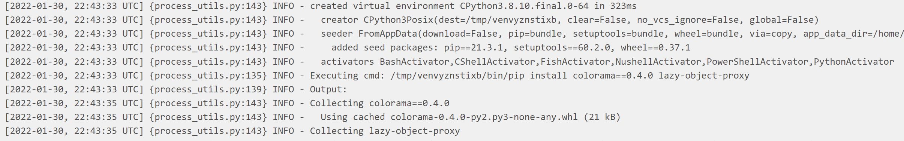

> 오늘은 Airflow의 DAG Task를 생성하는 방법에 대해서 정리해보려 한다. 기본적으로 DAG을 어떻게 생성하는지와 Operator 의 종류 및 구성에 대해서 살펴보자.


<br>

# DAG 생성하기
DAG을 생성하는 위치는 `airflow init` 명령어를 수행하면 생기는 `airflow.cfg`에 기록되어 있다. `[core] - dags_folder` 의 경로가 dag이 위치해야 하는 경로이다.
해당 Directory에 python 파일을 생성하면 dag이 추가되는 형태이다. 생성하고 싶은 단어를 입력해서 dag file 하나를 만들어보자.

DAG은 아래와 같이 airflow Module에서 가져올 수 있다. 

## DAG 생성 예시
- airflow module에서 DAG 호출.
- datetime.datetime을 사용해 날짜를 다룰 수 있다.
- default_args : dict 자료형으로 기본 인자를 설정할 수 있다. DAG안에 있는 Operator에 설정할 공통 속성에 대해서 이곳에 정의한다. 그렇기에 BaseOperator에 있는 값을 default_args 에 전달할 수 있다.
  - 인자값 설명 : <https://airflow.apache.org/docs/apache-airflow/stable/_api/airflow/models/index.html#airflow.models.BaseOperator>

  ``` python
  from airflow import DAG
  from datetime import datetime, timedelta

  default_args = {
      'start_date' : datetime(2022, 1, 28),
      'email' : ['shin12272014@gmail.com'],
      'email_on_failure' : True,
      'owner' : 'admin'
  }

  with DAG( dag_id = 'tutorial' , 
            default_args = default_args, 
            description = 'A simple tutorial DAG',
            schedule_interval = timedelta(days=1),
            start_date = datetime(2022, 1, 28 ),
            tags = ['example'] 
          ) as dag :
  ```


## Operator 종류
- Operator의 종류는 매우 다양하다. 어떤 것을 주로 사용하는지는 잘 모르겠으나 친절하게 아래의 페이지에 정리가 잘 되어있다. 주로 사용될 것으로 보이는 Operator 몇가지에 대해서만 정리해보자.
  - 링크 : <https://airflow.apache.org/docs/apache-airflow/stable/_api/airflow/operators/index.html>


### BashOperator
  ```python
  t1 = BashOperator ( 
          task_id = 'sleep_date', 
          bash_command = 'echo 1' )
  ```
  
### PythonOperator
#### Python Function Operator Task
- Python Fucntion을 하나의 Task로 만들 수 있다.
- PythonOperator도 존재하지만 Airflow 공식 Document에서는 Task Decorator를 이용한 방법이 소개 됨.
  ```python
  from airflow import DAG
  from airflow.decorators import task

  from datetime import datetime, timedelta
  from pprint import pprint

  default_args = {
      'start_date' : datetime(2022,1,30),
      'owner' : 'hsshin'
  }

  with DAG( dag_id = 'our_first_dag', default_args = default_args , schedule_interval = timedelta(days=1)) as dag:
      @task(task_id="print_the_context")
      def print_context(ds=None, **kwargs):
          print(ds)
          return 'Whatever you return gets printed in the logs'

      run_this = print_context(ds = 'abc'  )
  ```

#### virtualenv Python Operator Task
- virtualenv 환경에서도 실행되는 operator가 제공된다. 아래와 같이 코드를 입력하면 virtualenv 환경이 제공된다.
```python
  from airflow import DAG
  from airflow.decorators import task

  import shutil
  from datetime import datetime, timedelta
  from pprint import pprint

  default_args = {
      'start_date' : datetime(2022,1,30),
      'owner' : 'hsshin'
  }

  with DAG( dag_id = 'our_first_dag', default_args = default_args , schedule_interval = timedelta(days=1)) as dag:
      if not shutil.which("virtualenv"):
          pass
      else :
          @task.virtualenv(
              task_id = "virtualenv_python", requirements=["colorama==0.4.0"], system_site_packages = False
          )
          def callable_virtualenv():
              from time import sleep
              from colorama import Back, Fore
              print(Fore.RED + 'some red text')
              print(Back.GREEN + 'and with a green background')
              print('Finished')
          
          virtualenv_task = callable_virtualenv()
```
  

### BranchDateTimeOperator
- 시간에 따라 실행해야할 Task를 분기별로 설정하고 싶다면 이 Operator를 사용한다. 
  - ex) Operator들을 생성하고 22:00:00 ~ 23:15:00 경에는 Operator1을 실행하고 이외의 시간에는 다른 Operator를 실행하고 싶을 경우 사용.
    - `target_upper` : 23:15:00
    - `target_lower` : 22:00:00

  - 시간대를 설정할때 datetime.datetime을 통해 년월시간대 별로 조건 추가 가능.
  - datetime.time을 통해 매일 특정 시간에 실행하도록 조건 추가 가능.

``` python
from airflow import DAG
from datetime import datetime, timedelta, time
from airflow.operators.datetime import BranchDateTimeOperator
from airflow.operators.bash import BashOperator

default_args = {
    'start_date' : datetime( 2022, 2, 2 ) ,
    'owner' : 'hsshin', 
}
with DAG( dag_id = 'tutorial_2', 
          default_args = default_args,
          tags = ['tutorial'],
          schedule_interval = timedelta(days=1)
          ) as dag :
    
        t1 = BashOperator ( 
          task_id = 'date_in_range', 
          bash_command = 'echo "my name is t1"' 
        )

        t2 = BashOperator ( 
          task_id = 'date_outside_range', 
          bash_command = 'echo "my name is t2"' 
        )

        cond1 = BranchDateTimeOperator ( 
          task_id = 'datetime_branch',
          follow_task_ids_if_true=['date_in_range'],
          follow_task_ids_if_false=['date_outside_range'],
          target_upper=datetime(2022,2,2,23,4,0),
          target_lower=datetime(2022,2,2,23,0,0)

        )

        cond1 >> [t1, t2]

```

### SparkSubmitOperator
- spark-submit을 task로 만들어주는 operator.
  
**[설치 방법]**
1. `pip install apache-airflow-providers-apache-spark` 로 설치
2. airflow webserver - Admin - connections (ex. http://localhost:8080/connection/list/ ) 에서 connection 생성.
   1. Connection Type = Spark
   2. Host = local ( test용 )
3. 이후 아래의 코드와 같이 SparkSubmitOperator를 작성할 수 있음.
   1. [SparkSubmitOperator Document](https://airflow.apache.org/docs/apache-airflow-providers-apache-spark/stable/_api/airflow/providers/apache/spark/operators/spark_submit/index.html?highlight=sparksubmitoperator#airflow.providers.apache.spark.operators.spark_submit.SparkSubmitOperator) 참조

``` python
from airflow.providers.apache.spark.operators.spark_submit import SparkSubmitOperator

crawler_path = "/home/hsshin/scrap_result"
conv_respath = "/home/hsshin/tmp"
conv_filename = datetime.now().strftime("%Y%m%d_%H%M%S.tmp")

t3 = SparkSubmitOperator(
    application = "/home/hsshin/airflow/dags/NewsStatistics/converter.py",
    task_id = "spark_news_conv",
    conn_id = "spark_default", 
    application_args = [crawler_path, "csv", conv_respath, conv_filename]
)
```