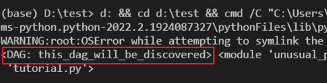

Airflow를 처음 사용할 때 DAG파일을 작성해도 인식이 안되는 문제를 종종 접하곤 했다.

문제 해결을 위해 공식 doc를 찾아보았고, [https://airflow.apache.org/docs/apache-airflow/stable/concepts/dags.html#loading-dags](https://airflow.apache.org/docs/apache-airflow/stable/concepts/dags.html#loading-dags)에 의하면 DAG은 파일 내에서 Global 변수로 선언되어야 Load를 한다고 명시가 되어있다. 

그냥 이 정도로만 알고있는 찰나 오픈채팅방에서 해당 주제가 다시 나오게 되었는데, 최근 파이썬을 깊게 사용해보고자 공부를 하고 있는 도중이라 Airflow에서 이를 어떻게 Python으로 구현하였는지 궁금해하지 않을 수가 없었다. 

그래서 오늘의 주제는 Airflow - DAG 인식하는 방법에 대해 코드리뷰를 진행해보고자 한다. 

<br>

# 1. DAG 처리하는 부분 소스에서 찾아보기!

일단 Airflow 자체를 디버깅하는 방법은 몰라서 DAG을 발견하지 못하면 나오는 로그를 통해 그 부분부터 찾아보는 것으로 시작을 했다.

Warning 로그는 다음과 같으며, `WARNING - No viable dags retrieved from "filepath"` 이 부분을 소스에서 한번 찾아보자.


## 1) airflow\dag_processing\processor.py - LINE 624
```python
    try:
        dagbag = DagBag(file_path, include_examples=False, include_smart_sensor=False)
    except Exception:
        self.log.exception("Failed at reloading the DAG file %s", file_path)
        Stats.incr('dag_file_refresh_error', 1, 1)
        return 0, 0

    self._deactivate_missing_dags(session, dagbag, file_path)
        
    if len(dagbag.dags) > 0:
        self.log.info("DAG(s) %s retrieved from %s", dagbag.dags.keys(), file_path)
    else:
        self.log.warning("No viable dags retrieved from %s", file_path)
        self.update_import_errors(session, dagbag)
        return 0, len(dagbag.import_errors)
```

해당 부분은 `airflow\dag_processing\processor.py` 파일안에 숨어있었다!
아래 소스를 보면 dagbag 이라는 인스턴스에 dags의 len을 구하고 값이 0 이하이면 WARNING을 찍게 구현하고 있음을 알 수 있다.

dagbag은 바로 윗부분의 try 구문쪽에서 생성하고 self._deactivate_missing_dags에도 전달을 한다. 
저 부분만 봤을때는 두곳중 하나에 dags를 채워주고 있을 것이 틀림없으므로 차례로 살펴보도록 하자.

## 2) airflow\models\dagbag.py - LINE 92
```python
def __init__(
        self,
        dag_folder: Union[str, "pathlib.Path", None] = None,
        include_examples: bool = conf.getboolean('core', 'LOAD_EXAMPLES'),
        include_smart_sensor: bool = conf.getboolean('smart_sensor', 'USE_SMART_SENSOR'),
        safe_mode: bool = conf.getboolean('core', 'DAG_DISCOVERY_SAFE_MODE'),
        read_dags_from_db: bool = False,
        store_serialized_dags: Optional[bool] = None,
        load_op_links: bool = True,
    ):
        # Avoid circular import
        from airflow.models.dag import DAG

        super().__init__()

        if store_serialized_dags:
            warnings.warn(
                "The store_serialized_dags parameter has been deprecated. "
                "You should pass the read_dags_from_db parameter.",
                DeprecationWarning,
                stacklevel=2,
            )
            read_dags_from_db = store_serialized_dags

        dag_folder = dag_folder or settings.DAGS_FOLDER
        self.dag_folder = dag_folder
        self.dags: Dict[str, DAG] = {}
        # the file's last modified timestamp when we last read it
        self.file_last_changed: Dict[str, datetime] = {}
        self.import_errors: Dict[str, str] = {}
        self.has_logged = False
        self.read_dags_from_db = read_dags_from_db
        # Only used by read_dags_from_db=True
        self.dags_last_fetched: Dict[str, datetime] = {}
        # Only used by SchedulerJob to compare the dag_hash to identify change in DAGs
        self.dags_hash: Dict[str, str] = {}

        self.dagbag_import_error_tracebacks = conf.getboolean('core', 'dagbag_import_error_tracebacks')
        self.dagbag_import_error_traceback_depth = conf.getint('core', 'dagbag_import_error_traceback_depth')
        self.collect_dags(
            dag_folder=dag_folder,
            include_examples=include_examples,
            include_smart_sensor=include_smart_sensor,
            safe_mode=safe_mode,
        )
        # Should the extra operator link be loaded via plugins?
        # This flag is set to False in Scheduler so that Extra Operator links are not loaded
        self.load_op_links = load_op_links
```

다음으로는 dagbag의 생성자를 먼저 살펴보도록 하자. dags 변수는 line 27에서 최초로 dict 으로 선언이 된다. dags을 모으는 부분이 어딘가에 있을텐데.. 소스를 보니 LINE 40 번째에 `self.collect_dags` 라는 함수가 실행이 되고 있다. 누가봐도 저기서 dags을 모으는 것 같으니 다음으로 저곳을 확인해보도록 하자.

## 3) airflow\models\dagbag.py - LINE 512
```python
# Ensure dag_folder is a str -- it may have been a pathlib.Path
dag_folder = correct_maybe_zipped(str(dag_folder))
for filepath in list_py_file_paths(
    dag_folder,
    safe_mode=safe_mode,
    include_examples=include_examples,
    include_smart_sensor=include_smart_sensor,
):
    try:
        file_parse_start_dttm = timezone.utcnow()
        found_dags = self.process_file(filepath, only_if_updated=only_if_updated, safe_mode=safe_mode)
        file_parse_end_dttm = timezone.utcnow()
        stats.append(
            FileLoadStat(
                file=filepath.replace(settings.DAGS_FOLDER, ''),
                duration=file_parse_end_dttm - file_parse_start_dttm,
                dag_num=len(found_dags),
                task_num=sum(len(dag.tasks) for dag in found_dags),
                dags=str([dag.dag_id for dag in found_dags]),
            )
        )
    except Exception as e:
        self.log.exception(e)
```
`collect_dags` 함수 내부를 보면 `self.process_file`을 호출하여 `found_dags`라는 변수에 무엇인가를 저장하고 있는 것이 보인다. filepath를 인자로 받는 것을 보아 저 곳에서 dag을 load 하고 있을 것으로 예상된다. 해당 함수로 가보자.

## 4) airflow\models\dagbag.py - LINE 285
```python
if filepath.endswith(".py") or not zipfile.is_zipfile(filepath):
    mods = self._load_modules_from_file(filepath, safe_mode)
else:
    mods = self._load_modules_from_zip(filepath, safe_mode)

found_dags = self._process_modules(filepath, modsfile_last_changed_on_disk)
```

`process_file` 내부를 확인해보자. 285 Line 을 보면 ".py" 로 끝나는 파일을 찾고 있는 것이 보인다. ".py"로 끝나는 filepath 들은 `_load_modules_from_file(filepath, safe_mode)` 로 보내고 있다. 다음으로 저 함수를 확인해보자.

## 5) airflow\models\dagbag.py - LINE 295 , airflow\utils\file.py - LINE 216
```python
def _load_modules_from_file(self, filepath, safe_mode):
    if not might_contain_dag(filepath, safe_mode):
        # Don't want to spam user with skip messages
        if not self.has_logged:
            self.has_logged = True
            self.log.info("File %s assumed to contain no DAGs. Skipping.", filepath)
        return []

    self.log.debug("Importing %s", filepath)
    org_mod_name, _ = os.path.splitext(os.path.split(filepath)[-1])
    path_hash = hashlib.sha1(filepath.encode('utf-8')).hexdigest()
    mod_name = f'unusual_prefix_{path_hash}_{org_mod_name}'

    if mod_name in sys.modules:
        del sys.modules[mod_name]

    def parse(mod_name, filepath):
        try:
            loader = importlib.machinery.SourceFileLoader(mod_name, filepath)
            spec = importlib.util.spec_from_loader(mod_name, loader)
            new_module = importlib.util.module_from_spec(spec)
            sys.modules[spec.name] = new_module
            loader.exec_module(new_module)
            return [new_module]
        except Exception as e:
            self.log.exception("Failed to import: %s", filepath)
            if self.dagbag_import_error_tracebacks:
                self.import_errors[filepath] = traceback.format_exc(
                    limit=-self.dagbag_import_error_traceback_depth
                )
            else:
                self.import_errors[filepath] = str(e)
            return []

```

```python
def might_contain_dag(file_path: str, safe_mode: bool, zip_file: Optional[zipfile.ZipFile] = None):
    """
    Heuristic that guesses whether a Python file contains an Airflow DAG definition.

    :param file_path: Path to the file to be checked.
    :param safe_mode: Is safe mode active?. If no, this function always returns True.
    :param zip_file: if passed, checks the archive. Otherwise, check local filesystem.
    :return: True, if file might contain DAGs.
    """
    if not safe_mode:
        return True
    if zip_file:
        with zip_file.open(file_path) as current_file:
            content = current_file.read()
    else:
        if zipfile.is_zipfile(file_path):
            return True
        with open(file_path, 'rb') as dag_file:
            content = dag_file.read()
    content = content.lower()
    return all(s in content for s in (b'dag', b'airflow'))
```

함수의 첫 문장으로 보맨 might_contain_dag 이라는 함수를 통해 filter를 하고있는 모습을 볼 수 있다.
해당 함수는 위와 같이 dag 파일 안에 dag이나, airflow라는 키워드가 존재하지 않으면 False를 return 하고 있음을 알 수 있다.
즉, dag을 식별하기 위한 첫번째 조건은 **<u>"dag 파일안에 dag과 airflow라는 키워드가 존재하지 않으면 안된다."</u>** 라고 정의할 수 있다.

다음으로 _load_modules_from_file 함수 안에 존재하는 `def parse(mod_name, filepath)` 함수를 살펴보자.
소스를 분석하면서 처음 알게된 모듈인데 `importlib` 이라는 것이 있다. [https://docs.python.org/ko/3/library/importlib.html](https://docs.python.org/ko/3/library/importlib.html)

간단하게 요약하면 해당 모듈은 python 파일을 import 하기 위해 사용하는 라이브러리다. 첫번째 코드 블록의 19 ~ 24 번째 라인이 이에 해당되는데 이 곳에서 module을 load한 후에 내부 정보를 받아올 수 있다. 

이렇게 모듈의 정보를 받아온 후에는 list 형태로 return 한 후 function은 종료가 된다. 

## 6) airflow\models\dagbag.py - LINE 395

```python
def _process_modules(self, filepath, mods, file_last_changed_on_disk):
    from airflow.models.dag import DAG  # Avoid circular import

    top_level_dags = ((o, m) for m in mods for o in m.__dict__.values() if isinstance(o, DAG))

    found_dags = []

```

다음은 `_process_modules` 함수이다. 4)번 항목의 코드블록에서  `_load_modules_from_file` 호출 이후에 `_process_modules` 를 호출했기 때문에 해당 function으로 넘어온 것이므로 당황하지 않길 바란다.

해당 function을 보면 top_level_dags라는 generator 생성 문이 보인다. 자세히보면 if절에 `isinstance(o, DAG)` 이라는 조건이 있는데 앞서 호출했던 모듈들의 `__dict__` 안에서 instance가 DAG 인 것에 대해서만 filtering 하고 있음을 알 수 있다. 

`__dict__` 변수에는 해당 모듈에서 전역변수에 올라가는 것, 기본 Built-in 내장 함수, Class 변수 등이 정의되어 있다.

```python
from airflow import DAG

def my_function():
    dag_2 = DAG('but_this_dag_will_not')

dag_1 = DAG('this_dag_will_be_discovered')
my_function()

DAG('this_dag_will_not_too')
```

위의 코드는 test 용으로 만들어본 DAG 파일이다. 해당 DAG 파일을 `importlib`을 통해 load 해서 `__dict__` 안의 key를 print 해보면 아래 이미지와 같이 나타남을 알 수 있다.


이제 Generator 에서는 어떤 결과가 나오는지에 대해 살펴보자

아래의 이미지는 Generator 조건에서 나오는 iterator를 순회한 이미지다. 

해당 코드를 보면 dag_1 = DAG('this_dag_will_be_discovred')에 대해서만 식별이 되고 있음을 알 수 있다.



# 결론
해당 테스트에서 얻어낸 결론은 두가지다. 첫번째는 **<u>"dag 파일안에 dag과 airflow라는 키워드가 존재하지 않으면 안된다."</u>** 이고, 두번째는 **<u>"importlib을 통해 load된 dag module의 __dict__ 에 DAG()을 인스턴스로 가지고 있는 변수가 존재"</u>** 해야 한다는 것이다. 

첫번째는 명확하지만 두번째는 조금 더 알아볼 필요가 있다. __dict__ 안에 instance 변수가 포함이 되는 조건은 과연 무엇일까? 

위의 예제를 보면 my_function() 안에 들어가있는 DAG은 표시가 되지 않고 `DAG('this_dag_will_not_too')` 또한 표시가 되지 않는다. 

우선 각각에 대해 dis library를 통해 어떤식으로 동작을 하는지 살펴보자.

<br>

## test 1. dis 모듈을 통해 instruction을 살펴보자.
```python
from airflow import DAG
import dis
def my_function():
    dag_2 = DAG('but_this_dag_will_not')

dis.dis('dag_1 = DAG(\'this_dag_will_be_discovered\')')
dis.dis('my_function()')
dis.dis('DAG(\'this_dag_will_not_too\')')
```

```text
(base) D:\test>python -m dis tutorial.py
...

  4          20 LOAD_CONST               3 (<code object my_function at 0x000001E9B95B4710, file "tutorial.py", line 4>)
             22 LOAD_CONST               4 ('my_function')
             24 MAKE_FUNCTION            0
             26 STORE_NAME               3 (my_function)

  7          28 LOAD_NAME                1 (DAG)
             30 LOAD_CONST               5 ('this_dag_will_be_discovered')
             32 CALL_FUNCTION            1
             34 STORE_NAME               4 (dag_1)

  8          36 LOAD_NAME                3 (my_function)
             38 CALL_FUNCTION            0
             40 POP_TOP

  9          42 LOAD_NAME                1 (DAG)
             44 LOAD_CONST               6 ('this_dag_will_not_too')
             46 CALL_FUNCTION            1
             48 POP_TOP
             50 LOAD_CONST               2 (None)
             52 RETURN_VALUE

Disassembly of <code object my_function at 0x000001E9B95B4710, file "tutorial.py", line 4>:
  5           0 LOAD_GLOBAL              0 (DAG)
              2 LOAD_CONST               1 ('but_this_dag_will_not')
              4 CALL_FUNCTION            1
              6 STORE_FAST               0 (dag_2)
              8 LOAD_CONST               0 (None)
             10 RETURN_VALUE
```

우선 dis libary로 나오는 명령어들의 정의에 대해서 살펴보자.

|CODE|의미|
|----|----|
|STORE_NAME|STORE_FAST 혹은 STORE_GLOBAL 진행. 즉, global 변수 선언을 하거나 local 변수로 선언이 될 수 있다는 의미|
|STORE_FAST|Top of Stack에 있는 것을 local 변수로 저장|
|LOAD_CONST|const로 저장된 값을 stack 위에 push 하는 명령어, 정확하게 어느 영역인지는 모르겠다.|

이제 dis를 통해 앞선 코드들을 실행한 결과를 보자. 결과를 보면 오직 `dag_1 = DAG()` 에서만 `STORE_NAME` 이라는 Instruction 이 생성되고 있다는 것을 알 수 있다. 

반면에 `dag_2`와 `DAG('this_dag_will_not_too')`는 어떠한가? `LOAD_CONST` 및 `STORE_FAST` 만 할뿐 `STORE_NAME`은 어디에서도 발생하지 않음을 알 수 있다.

위의 사항들을 통해 유추해 봤을때 결국 **module을 import 했을때 사용이 가능한 변수들 = 전역 변수** 들에 대해서만 __dict__ 에 적재가 되고 있음을 추측 해볼 수 있다.

결국 global 변수에 대해서는 모두 DAG으로 인식이 가능하다는 뜻으로 이해가 된다. 한번 테스트 해보자.

## test 2. 전역변수는 모두 인식이 가능하지 않을까?
```python
from airflow import DAG

dag_2 = None
def my_function():
    global dag_2
    dag_2 = DAG('is_possible_1')
    globals()['dag_3'] = DAG('is_possible_2')


dag_1 = DAG('this_dag_will_be_discovered')
my_function()
globals()['dag_4'] = DAG('is_possible_3')
```

위의 코드는 다양한 전역변수 선언 방법들로 DAG을 생성한 코드이다. 해당 코드로 Generator 에서 어떤 결과를 출력하는지 체크해보자.


예상대로 DAG으로 인식되고 있음을 알 수 있다. **즉, Airflow에서는 전역변수로 DAG instance를 생성할 수 있다면 DAG으로 인식 가능하다는 것이 이번 실험이 결론**이 되겠다.


<br>

# 후기
테스트한 케이스들은 사실 실제 사용하는 상황과는 전혀 상관없기 때문에 실용성이 없는 테스트이긴 하다. 그래도 airbnb 개발팀에서 python을 어떻게 사용했었는지에 대해서 살짝 맛볼수가 있어서 좋은 경험이였던 것 같다. 당분간은 python을 꾸준히 사용해 볼 생각이다. 기회가 된다면 spark나 다른 오픈 소스들에 대해서도 코드를 찾아보고자 한다. 특히 MP 시스템이 어떻게 구현이 되어있는지에 대해 궁금하지 않을수가 없다. 다음번에는 좀 더 실용성있는 내용의 post를 적어보겠다 다짐한다! 