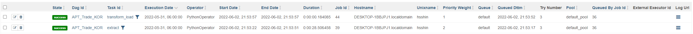

Helm에 관해서 알아보던 중 Airflow의 기본 구조에 대해서 명확하게 정리가 되어있지 않은 상태인 것을 직시했다. 그래서 오늘은 Airflow 기본 Concept 및 Scheduler에 대해서 정리해보자. 

# Airflow - 기본 Concept

Airflow는 task가 node 단위로 구성된 여러 개의 DAG(Directed Acycle Graph)을 의존성에 따라서 실행을 하는 프레임워크이다.  
그리고 이를 원활하게 실행하기 위해서 크게 5가지의 components로 구성이 되어있다.  

|component|description|
|----|----|
|scheduler|스케줄러는 계획된 workflow들을 실행시키거나, 실행되어야 할 tasks들을 executor에게 제출.|
|executor|실행되고 있는 task들을 handle. 기본적으로 설치되는 이 작업이 모두 scheduler 내부에서 이뤄지지만 실제 운영 환경에서 사용되는 executors (celery, local .. )에서는 task의 실행을 workers들에게 넘김.|
|webserver|DAG과 task 상태 파악을 쉽게하기 위해 제공되는 Web UI.|
|DAG Directory|scheduler와 executor가 참조하는 DAG 폴더|
|metadata Database|scheduler, executor가 상태를 저장하기 위해 사용하는 database. default로 sqlite를 사용하지만 단일 connection만 제공되기 때문에 이후에는 다른 것으로 교체해야 함.|

위의 내용에서 executor 쪽이 쉽게 와닿지 않는다. 특히 worker 사용이 무슨 의미인지 정확하게 이해가 되지 않는다.  
실행 속도를 위해 병렬성을 줄것이냐 말것이냐의 차이로 보이는데 한번 살펴보자.

----

# Executor

우선 Executor는 task instances들을 실행하기 위해 사용되는 기술적인 부분이다.  
여기서 task instances란 아래 이미지와 같이 airflow에서 관리되는 task 목록을 뜻한다.  

결국 Executor란 이 instance들을 어떻게 효율적으로 실행시킬 것인가에 대한 component 라고 볼 수 있다.

Executor는 크게 두 분류로 나뉜다. **Local Executors**와 **Remote Executors**가 있다.  
Local Executors는 말그대로 Local 환경에서 실행되는 Executor이고 Remote Executors의 경우 workers pool을 사용해 원격으로 실행을 시키는 방식이다. 

Airflow에서는 SequentialExecutor를 기본적으로 제공 중이나 LocalExecutor로 변경을 할 것을 권장한다.  
그럴거면 SequentialExecutor는 없애면 되지 않나 싶겠으나 이게 가장 안전한 옵션이라고 한다. 

만약 multi-machine이나 cloud를 사용중이라면 Remote Executor 중에 하나를 선택할 것을 권장한다.  
종류는 다음과 같다.

**[Local Executors]**
- Debug Executor
- Local Executor
- Sequential Executor

**[Remote Executors]**
- Celery Executor
- CeleryKubernetes Executor
- Dask Executor
- Kubernetes Executor
- LocalKubernetes Executor

이번 글에서는 위의 것중 Sequencetial, Local, Celery Executor에 대해서만 간략하게 정리를 하고자 한다.

## Local Executors - Sequential Executor
airflow 설치시 기본적으로 제공되는 Executor이다.  
sqlite를 meta 데이터로 사용하는데 이것은 multiple connections를 제공하지 않기 때문에 병렬처리가 전혀 고려되어 있지 않은 Executor이다.

그래서 이 Executor는 하나의 task 이상은 동시에 실행할 수 없다.

## Local Executors - Local Executor
**LocalExecutor**는 multi-process 환경에서 돌아가는 Executor이다.  
그래서 sqlite이 아닌 다른 db를 meta db로 사용해야 된다. ( DE 강의에서는 postgresql을 사용했었다. )

parallelism 속성을 통해서 병렬성의 정도를 설정할 수 있다.  
만약 이것이 1 이라면 **SequentialExecutor**와 동일하게 동작한다고 봐야한다.

## Remote Executors - Celery Executor

Celery Executor는 worker의 개수를 통해 자유롭게 scale-out을 할 수 있는 방법 중의 하나이다.  
여기서 worker란 process가 아닌 pc node 단위로 보인다.  

이 Executor는 Celery라는 외부 프레임워크를 통해 구성되는데, Celery는 간략하게 말하면 Distributed Task Queue 시스템으로 이해하면 된다.  

Kafka에서 Broker가 message를 받아서 병렬로 처리하던 방식과 비슷하게 Distributed 시스템에서 handler 역할을 하는 component로 이해하는 것이 맞는 것 같다.  
어쨋든 이 Celery를 사용하기 위해 RabbitMQ나 Redis를 설치해야 한다.

아래 시퀀스 다이어그램을 살펴보자.  

Scheduler는 Celery(QueueBorker)에게 task를 전달하고 Borker는 이 task들을 worker들에게 할당한 이후  worker 내부적으로 process를 생성하여 task를 실행한 이후에 결과를 다시 Scheulder에게 전달을 해준다. 

# 글을 마치며

오늘은 Airflow의 기본 컨셉과 Executor에 대해서 알아보았다.  
확실히 애매하게 알고있는 것을 다시 정리하니 답답한 것이 사라져서 기분이 좋다.  
특히 Celery Executor가 무엇인지 정리를 하고나니 가슴이 뻥 뚫린 기분이다. 

Remote Executors의 경우에는 종류가 다양하고 내용이 어려운 것들이 많아서 이것들에 대해서는 개별로 한번 따로 정리를 해볼 생각이다.  
특히 Helm-Chart를 사용하는 Kubernetes Executor는 더 궁금증을 야기하는 것 같다.

앞으로 시간이 있을지는 모르겠지만.. 기회가 되면 한번 정리해보자 ヾ(^▽^*)))