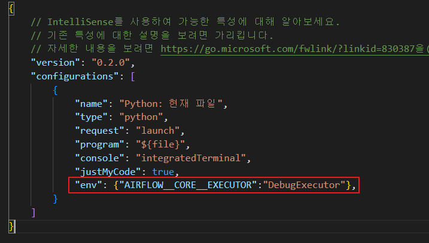
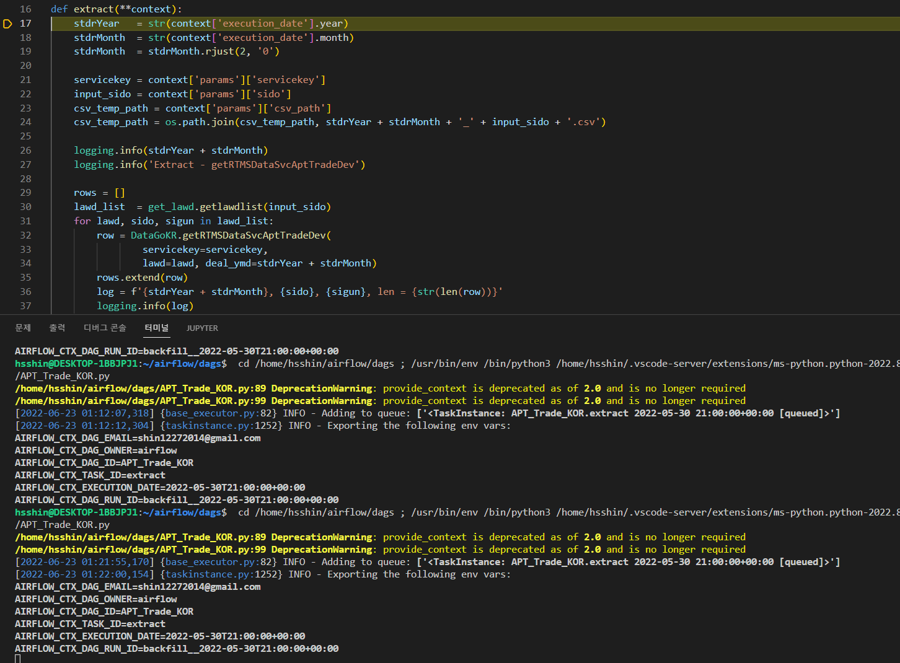

# Debuging 방법

1. Airflow Executor를 DebugExecutor 변경
   - IDE Tool에서 enviorment 설정을 통해 Executor를 DebugExecutor로 변경할 수 있다.
     - airflow.cfg 파일에는 별다른 내용을 추가하지 않아도 된다.
   
2. DAG 아래에 코드 추가
   - DAG아래 아래의 코드를 추가한다.
    ```python
    if __name__ == "__main__":
        from airflow.utils.state import State
        dag.clear()
        dag.run(start_date=datetime(year=2022, month=4, day=30, hour=21,minute=0, second=0))
    ```
   - dag.clear() 이후 dag.run()으로 실행 가능.
     - run에는 다양한 인자를 설정할 수 있으니 참조.
3. 이후 IDE tool에서 디버깅을 하면 정상적으로 디버깅할 수 있다.
   


# 참조
- Visual Studio Code Docs : [https://code.visualstudio.com/docs/editor/debugging]
- Airflow - Debug Executor : [https://airflow.apache.org/docs/apache-airflow/stable/executor/debug.html#debug-executor]