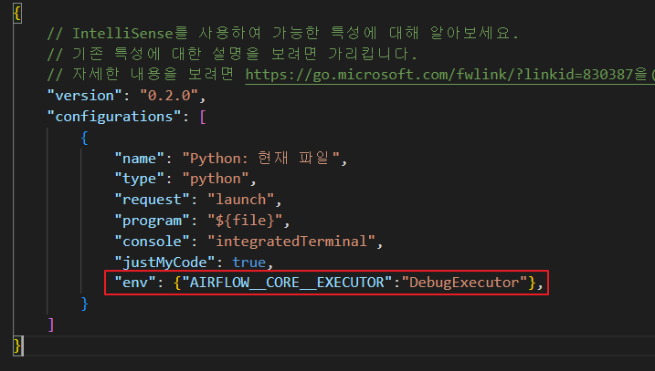
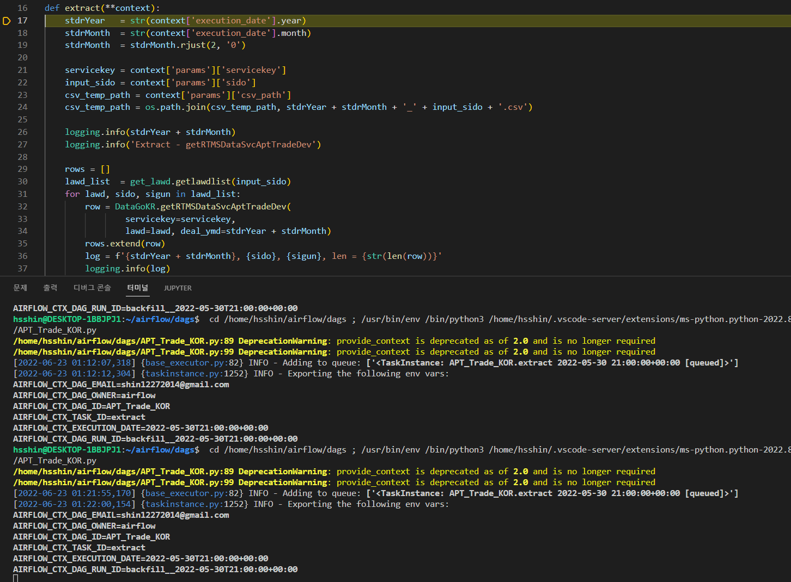

# Debuging 방법

1. Airflow Executor를 DebugExecutor 변경
   - IDE Tool에서 enviorment 설정을 통해 Executor를 DebugExecutor로 변경할 수 있다.
     - airflow.cfg 파일에는 별다른 내용을 추가하지 않아도 된다.
   
2. DAG 아래에 코드 추가
   - DAG아래 아래의 코드를 추가한다.
    ```python
    if __name__ == "__main__":
      from airflow.utils.state import State
      KST = timezone(timedelta(hours=9))
      start_date=datetime(year=2022, month=5, day=1, hour=21, minute=0, second=0, tzinfo=KST)
      end_date=datetime(year=2022, month=6, day=1, hour=21, minute=0, second=0, tzinfo=KST)
      dag.clear()
      dag.run(start_date = start_date, end_date = end_date, ignore_task_deps=True)
    ```
   - dag.clear() 이후 dag.run()으로 실행 가능.
     - run에는 다양한 인자를 설정할 수 있으니 참조.
     - **ignore_task_deps를 True**로 하면 dag안에 있는 모든 task에 대해서 test가 가능한 것 같다.
3. 이후 IDE tool에서 디버깅을 하면 정상적으로 디버깅할 수 있다.
   


# 참조
- Visual Studio Code Docs : <https://code.visualstudio.com/docs/editor/debugging>
- Airflow - Debug Executor : <https://airflow.apache.org/docs/apache-airflow/stable/executor/debug.html#debug-executor>