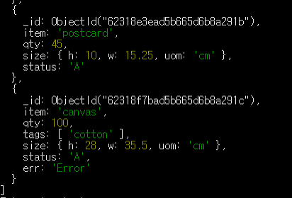

# Document Store
이제까지 알아봤던 NoSQL 종류는 "성능 향상"을 기준으로 했다면 이번에는 "데이터 처리의 유연성"을 기준으로 분류된 NoSQL에 대해 알아볼 차례다.

도큐먼트 스토어가 이런 종류의 NoSQL인데 JSON이나 XML 처럼 복잡하게 얽힌 스키마리스 데이터를 그대로의 형태로 저장하고 쿼리를 실행할 수 있도록 해준다.

```JSON
{
    '_id' : 1,
    'artistName' : { 'Iron Maiden' },
    'albums' : [
        {
            'albumname' : 'The Book of Souls',
            'datereleased' : 2015,
            'genre' : 'Hard Rock'
        }, {
            'albumname' : 'Killers',
            'datereleased' : 1981,
            'genre' : 'Hard Rock'
        }, {
            'albumname' : 'Powerslave',
            'datereleased' : 1984,
            'genre' : 'Hard Rock'
        }, {
            'albumname' : 'Somewhere in Time',
            'datereleased' : 1986,
            'genre' : 'Hard Rock'
        }
    ]
}
```

기존 RDB와 차이점에 대해서 알아보자. Table, Schemas, Scalability, Relationships 의 관점에서 살펴보도록 하자

**Table**
RDB에서는 데이터를 여러가지의 table로 구성하여 넣곤한다. 각 테이블은 column으로 구성되어 있고 행이 쌓이는 형태로 데이터가 적재된다.

허나, Document DB에서는 이러한 Table의 개념이 없다. Document DB에서는 주어진 모든 Entity를 하나의 document라는 개념에 저장하고, 관련 데이터 또한 이 document에 적재를 하는 방식이다.

**Schemas**
RDB에서는 데이터 삽입전 컬럼의 정보를 담고있는 schema가 반드시 요구된다. 허나 document store DB에서는 이런 요구사항이 존재하지 않는다.

그래서 document 마다 서로 다른 타입의 구조로 데이터 저장이 가능하다. 
예를 들자면 어느 사용자는 "date of birth"를 포함하지 않고, 어떤 사용자는 "date of birth"를 포함하는 등의 서로 다른 스키마 구조를 가질 수 있게 되는 것이다.

**Scalability**
사업이 확장되어 데이터가 많아짐에 따라 성능 향상을 시켜야될 경우가 존재한다. RDB 같은 경우에는 하나의 서버의 성능을 올려야 하는 Scale-up 방식이나 Document store DB는 scale-out의 형태로 확장성을 높일 수 있다고 한다.

**Relationships**
Document Store에는 foreign keys의 개념이 없다. 만약 relationship이 필요하다면 application Level에서 제공이 되어야 한다고 한다. 

그러나 Document Store의 기본 컨셉은 레코드와 연결된 모든 데이터는 동일한 문서내에 존재해야 한다는 것이다. 그래서 애초에 RDB와 같이 관계의 범위가 Document를 벗어나는 것은 있으면 안된다.

RDB 와의 차이점은 여기까지 알아보고 다음으로는 Key-Value Store 와의 차이점에 대해서 알아보자.

둘다 Key를 기준으로 Value를 저장한다는 것은 비슷하지만 Value를 다루는 기준에 차이가 있다. Document DB의 경우에는 semi-structured / structured 단위로 value가 저장된다. 즉 XML, JSON, YAML 등의 하위 structured에 대해서 encoding이 된다는 것이 큰 차이점이다.

이제 직접 Document Store(MongoDB)를 사용해 위의 개념들이 실제로 어떻게 적용되고 있는지 직접 확인해보자.

<br>

# MongoDB 

## Overview
MongoDB는 document store 대표적인 제품 중 하나라고 한다.
data records를 `BSON documents` 라고 하는 컨셉으로 적재하고 이는 `collections` 라는 개념의 집합으로 이뤄진다. 그리고 우리가 흔히알고 있는 `database` 는 하나 이상의 `collections` 로 구성된다. 

키워드들에 대해서 하나하나 살펴보자.

**Databases**
일반적으로 우리가 생각하는 Database와 동일하다. RDB를 사용해봤다면 이와 동일한 컨셉이다.

**Collections**
RDB에서의 table에 해당되는 개념이다. documents라는 것을 이 collections에 적재하게 된다.


**Documents**
MongoDB는 data records를 BSON document라는 형식으로 적재한다. 여기서 BSON은 JSON의 Binary 표시 형태이다. [https://bsonspec.org/](https://bsonspec.org/)

Documents의 structure는 field - value의 쌍으로 구성된다. 
```json
{
   field1: value1,
   field2: value2,
   field3: value3,
   ...
   fieldN: valueN
}
```

value는 BSON data type으로 정의할 수 있다. 여기에는 document, array, array of document 또한 포함이 된다.

documents는 같은 collection 안에서 서로 다른 attribute를 가질 수 있다.



document를 보면 `ObjectId`라는 것이 자동으로 들어가게 된다. 이는 collection에서 document를 구분하기 위해 사용되는 일종의 `Primary key` 개념으로 이해할 수 있다. 

구조는 아래와 같이 구성되어 있다.


기본 컨셉에 대해서는 여기까지만 살펴보고 추가 내용에 대해서는 test를 진행할때 살펴볼 수 있도록 하자.

## 설치하기
우선 [https://www.mongodb.com/try/download/enterprise](https://www.mongodb.com/try/download/enterprise)에서 MongoDB를 다운받도록 하자. local에서 사용할 것이므로 On-premises로 설치파일을 받은 후, 실행시키도록 한다.

