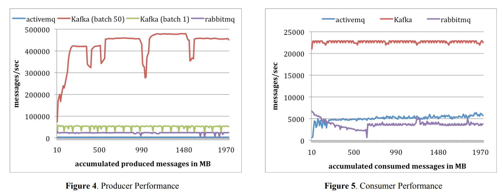
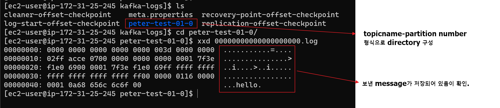

본 문서는 [실전 카프카] 개발부터 운영까지 - Chapter3 : Kafka의 기본 개념과 구조를 참조하였습니다.

# 카프카란?
- Kafka는 링크드인에서 개발된 분산 메시지 처리 플랫폼으로 **대용량 데이터 실시간 스트리밍**을 위해 주로 사용합니다.
  - 주로 Message(데이터)를 받아서 필요한 app에 전달해주는 handler 역할로 사용됩니다.
  - 그밖에도 [https://engineering.linkedin.com/distributed-systems/log-what-every-software-engineer-should-know-about-real-time-datas-unifying](https://engineering.linkedin.com/distributed-systems/log-what-every-software-engineer-should-know-about-real-time-datas-unifying) 에서 여러가지 활용 사례들을 볼 수 있습니다.
- 많은 기업에서 현재 서비스를 운영함에 있어 카프카를 운영하고 있습니다.
  - 대표적으로 넷플릭스, 우버, 잘란도, 트위터, 라인, 카카오, 네이버 등이 있습니다.
  - 2020년 기준으로 포춘 100대 기업 중 80% 이상이 카프카를 사용.
- 메시지 처리 플랫폼은 카프카 외에도 RabbitMQ, Pulsar 등이 있으며 **메시지 처리량 및 반응 속도**를 기준으로 Performance를 비교합니다. 필요에 따라 RabbitMQ를 사용하는 경우도 존재합니다.

# 왜 카프카를 사용하나요?
- 다른 플랫폼과 비교시 높은 성능을 가지고 있습니다. **다른 플랫폼들과 비교시 낮은 지연율과 높은 메시지 처리량**를 가지고 있기에 많이 사용 됩니다.
  - 타 플랫폼들 대비 Producer, Consumer 메시지 처리량을 비교한 image ( 출처 : [https://pages.cs.wisc.edu/~akella/CS744/F17/838-CloudPapers/Kafka.pdf](https://pages.cs.wisc.edu/~akella/CS744/F17/838-CloudPapers/Kafka.pdf) ) 
  

- 서비스 확장에 따라 카프카의 성능을 높여야 한다면 편리하게 Scale out이 가능하도록 높은 확장성을 제공합니다.
- 고가용성 (오랜 시간동안 문제없이 작동) 을 보장합니다. if kakao 2018 "카프카, 산전수전 노하우" 발표에 따르면 2년 기준으로 99.99% 의 가용성을 유지했다고 언급이 되어 있습니다.
- 데이터를 하나의 server에만 저장하는 것이 아닌 클러스터화 된 여러 server에도 저장하여 하나의 server가 사용불가 상태가 되더라도 복구가 가능하도록 설계되어 있습니다. 

----

# 카프카를 사용하는 다양한 사례들
- 넷플릭스 - 데이터 파이프라인 
  - [https://netflixtechblog.com/evolution-of-the-netflix-data-pipeline-da246ca36905](https://netflixtechblog.com/evolution-of-the-netflix-data-pipeline-da246ca36905)
    

- 우버 - 데이터 통합
  - [https://eng.uber.com/ureplicator-apache-kafka-replicator](https://eng.uber.com/ureplicator-apache-kafka-replicator)
    

- 머신러닝 분야 활용 사례
  - [https://www.confluent.io/blog/build-deploy-scalable-machine-learning-production-apache-kafka](https://www.confluent.io/blog/build-deploy-scalable-machine-learning-production-apache-kafka)
  

----

# 카프카의 기본 구조
- 카프카는 기본적으로 Pub/ Sub 기반 Event Driven Architecture로 구성되어 있습니다. 주요 요소들로는 아래와 같습니다.
    
    | 주요 요소                 | 설명                                                                        |
    | ------------------------- | --------------------------------------------------------------------------- |
    | 브로커                    | 카프카 애플리케이션이 설치된 서버 또는 Node를 뜻함.                         |
    | 카프카 or 카프카 클러스터 | 여러 대의 브로커를 구성한 클러스터                                          |
    | 주키퍼 (zookeeper)        | 카프카의 메타데이터 관리 및 브로커의 정상상태 점검을 담당.                  |
    | 프로듀서                  | 카프카로 메시지를 보내는 역할을 하는 클라이언트를 총칭.                     |
    | 컨슈머                    | 카프카에서 메시지를 꺼내가는 역할을 하는 클라이언트를 총칭.                 |
    | 토픽                      | 카프카 내에서 메시지 피드들을 구분할때 사용 되는 단위.                      |
    | 파티션                    | 병렬처리 + 고성능을 얻기 위해 하나의 토픽을 여러 개로 나눈 것을 의미        |
    | 세그먼트                  | 프로듀서가 전송한 실제 메시지가 브로커의 로컬 디스크에 저장되는 파일을 뜻함 |
    | 메시지 or 레코드          | 프로듀서가 브로커로 전송하거나 컨슈머가 읽어가는 데이터 조각을 뜻함         |

## 카프카 - 리플리케이션
- 메시지를 보낼 때 하나의 브로커로만 보내지 않고 여러 개의 브로커에 동일한 메시지를 보내는 동작을 의미합니다.
- 메시지를 여러 위치에 분산 저장하기 때문에 하나의 카프카 server(브로커) 에 문제가 발생하더라도 안정성을 유지할 수 있습니다.
- **kafka-topics.sh** 명령어에서 `--replication-factor` 인자를 통해 설정이 가능합니다. 만약 이 값을 3으로 설정하면 3개의 브로커에 동일한 메시지를 저장하게 됩니다. 
  - replication-factor는 현재 구성된 카프카 브로커의 개수보다 클 수 없습니다. 3개의 브로커를 통해 4개의 replication factor를 설정하면 에러가 발생합니다.
- topic을 기준으로 리플리케이션이 되는 것이 아닌 **토픽의 파티션을 기준**으로 리플리케이션 됩니다. ( 책에서 여러번 강조하는 것을 보아 중요한 내용인 것 같습니다. )
- 리플리케이션 팩터수가 커지면 **안전성**이 높아지지만 브로커의 로컬에 저장을 하기 때문에 리소스를 많이 사용하게 됩니다. 복제에 대한 오버헤드를 줄여서 브로커를 효율적으로 사용하는 것이 중요합니다.
  -  추천 replication-factor
  
     | Case                                             | 추천 개수 |
     | ------------------------------------------------ | --------- |
     | 테스트 or 개발환경                               | 1         |
     | 운영 환경 ( 로그성 메시지로서 약간의 유실 허용 ) | 2         |
     | 운영 한경 ( 유실 허용 X )                        | 3         |

## 파티션
- 토픽에서 메시지가 처리될때 높은 성능 및 병렬성을 제공해주기 위해 사용되는 컨셉입니다. 
- 하나의 토픽은 여러 개의 파티션을 가집니다. 아래의 이미지에서는 하나의 토픽에 4개의 파티션이 구성되어 있음을 알 수 있습니다.

- 적절한 파티션을 구하는 기준은 각 메시지 크기나 초당 메시지 건수에 따라 달라지므로 정확하게 예측을 하는 것은 힘듭니다. 공식이 존재하긴 하지만 정확하게 예측하는 것은 어렵다고 합니다.
- 파티션의 수는 초기 생성 후 언제든지 늘릴수는 있지만 반대로 줄일수는 없기 때문에 신중하게 선택을 해야합니다.
  - 책에서는 초기에는 2개 또는 4개 정도로 설정한 후, 메시지 처리량이나 컨슈머의 LAG(프로듀서가 보낸 메시지수 - 컨슈머가 가져간 메시지수)를 모니터링하면서 조금씩 늘려가는 방법이 가장 좋다고 합니다.

## 세그먼트
- 카프카는 프로듀서에서 보낸 메시지를 브로커의 Local에 저장을 합니다. 앞선 설명과 같이 토픽-파티션 단위로 구성되어 특정 파일 단위로 메시지를 저장하는데 이 단위를 **세그먼트**라고 부릅니다. 
- 하나의 파티션에는 여러개의 세그먼트가 존재 할 수 있습니다.
- `/data/kafka-logs/` 경로에 저장이 되며 실제 카프카 서버에서 해당 폴더로 이동해보면 세그먼트가 저장되어 있음을 알 수 있습니다.
    

----

# 카프카의 핵심 개념

여러 기업에서 카프카를 서둘러 도입하고 많은 개발자가 좋아하는 이유는 카프카의 높은 처리량, 빠른 응답 속도, 안정성 때문입니다. 하지만 카프카가 어떻게 위와 같은 사항을 충족할 수 있게 되었는지에 대해서는 그다지 잘 알려지지 않았다고 합니다. 각 특성들을 하나씩 살펴보며 카프카를 좀 더 깊이 알아봅시다.

## 분산 시스템
- 분산 시스템은 네트워크상에 연결된 컴퓨터들의 그룹을 말하며, 단일 시스템이 갖지 못하는 높은 성능을 목표로 합니다.
- 성능이 높은 것 이외에도 장애 발생시 다른 서버가 역할을 대신 수행하는 것으로 대응이 가능하며 부하가 높은 경우에는 scale-out을 쉽게 할 수 있다는 장점이 있습니다.
- 카프카에서도 브로커를 추가하는 것으로 기능 확장이 가능합니다.
  - 최초에는 3대의 브로커를 운영 중이어도 서비스가 증가할 경우 이후에는 총 50대 이상의 브로커를 확장하는 것이 가능합니다.

## 페이지 캐시
- 물리 메모리 중 애플리케이션이 사용하지 않는 일부 잔여 메모리를 활용하여 페이지 캐싱용으로 사용.

## 배치 전송 처리, 압축 전송
- 메시지를 실시간으로 전달하지 않고 배치로 전송하는 것도 가능합니다. 로그 시스템의 경우 실시간으로 처리하는 것보다는 배치로 처리하는 것이 더 좋습니다.
  - default는 아닌 것 같고 batch.size 를 통해서 조절이 가능한 것으로 보임.
- 카프카에서는 gzip, snappy, lz4, zstd 등의 압축을 지원합니다. 높은 압축률이 필요한 경우 gzip, zstd를 권장하고 빠른 응답 속도가 필요하다면 lz4, snappy를 권장합니다. 

## 토픽, 파티션, 오프셋
- 토픽 : 카프카에서 데이터를 저장하는 곳입니다. 흔히 사용하는 이메일 주소 정도의 개념으로 이해하면 좋습니다.
- 파티션 : 병렬 처리를 위해 하나의 토픽은 여러개의 파티션으로 나눌 수 있습니다.
  - key 값을 기준으로 kafka 자체에서 hashing 하여 파티션 밸런스 조정을 진행합니다.
  - key를 제공하지 않을 경우 라운드 로빈 방식으로 메시지를 전송합니다.
- 오프셋 : 파티션에 메시지가 저장되는 위치를 Offset이라고 부르며 64bit 정수 단위로 index를 가집니다.
  - 컨슈머에서는 마지막까지 읽은 위치를 알 수 있습니다. ( Commit )

## 고가용성 보장
- 카프카는 분산 시스템이기 때문에 하나의 서버나 노드가 다운되어도 다른 서버 또는 노드가 장애가 발생한 서버의 역할을 대신해 안정적인 서비스가 가능합니다. 이러한 것을 보장해주기 위해 사용되는 기능이 카프카의 리플리케이션 기능입니다. 
- 앞의 리플리케이션 항목에서도 언급된 것처럼 리플리케이션 기능은 토픽 자체가 아닌 **토픽의 파티션을 복제합니다.**
- 카프카에서는 원본의 경우 `리더` 라고 부르고 미러링되는 것은 `팔로워`라고 부릅니다.
  - ex) 리플리케이션 팩터수 2 = 리더 수 1 + 팔로워 수 1
        리플리케이션 팩터수 3 = 리더 수 1 + 팔로워 수 2
- 리플리케이션 팩터수는 무조건 높다고 좋은 것은 아닙니다. 늘어날 수록 안정성은 보장이 되나 디스크 공간을 차지하기 때문에 **일반적으로 카프카에서는 리플리케이션 팩터수를 3으로 설정하는 것을 권장**합니다.

## Zookeeper의 의존성
- 주키퍼는 분산 어플리케이션에서 코디네이터로 쓰입니다. 하둡, 나이파이, 에이치베이스 등에서도 사용되고 카프카에서도 사용됩니다.
- 여러대의 서버를 클러스터로 구성하고, 현재 작동중인 서버가 과반수이상 유지된다면 지속적인 서비스가 가능한 구조입니다. 과반수 비교를 위해서는 항상 홀수로 구성되어야 하기 때문에 주키퍼는 홀수를 유지해야 합니다.
- 주키퍼는 znode를 이용해 카프카의 메타정보를 기록합니다. 이 정보를 통해 노드, 토픽, 컨트롤러 관리 등 매우 중요한 역할을 하고 있습니다.
- 카프카 3.0에서는 KRaft 알고리즘이라는 것을 사용해 주키퍼 의존성이 제거되었다고 합니다. 하지만 운영 환경에서 사용을 하는 것은 권장되고 있지 않다고 합니다. 이처럼 카프카에서는 주키퍼의 의존성을 제거하려는 추세로 개발을 진행중 입니다.

----

이처럼 카프카의 기본 컨셉 및 여러 특성에 대해서 정리를 해보았습니다. 메시징 드리븐 아키텍쳐와 분산시스템으로 확장성을 자유롭게 조절을 할 수 있는 것이 참 인상적이였는데요, 다시 한번 디자인 패턴이 참 중요하구나라고 느끼지 않을수가 없었습니다. 다음장부터는 카프카 브로커, 프로듀셔, 컨슈머 순으로 자세하게 알아보도록 하겠습니다. 
감사합니다 😃