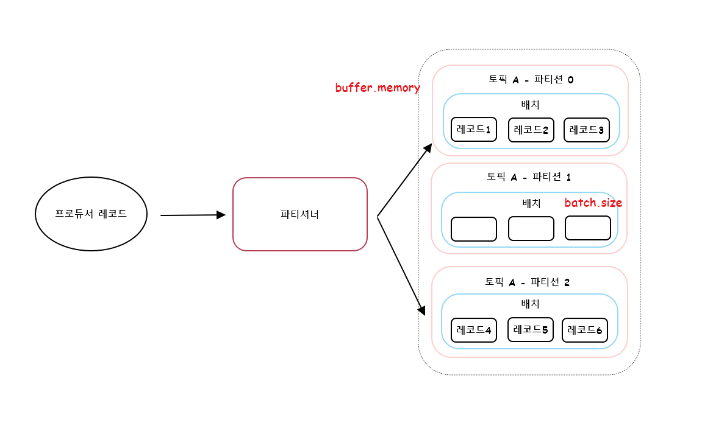
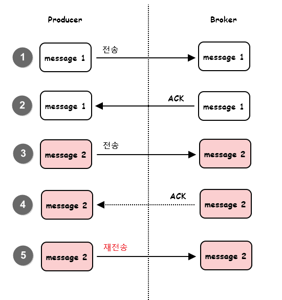
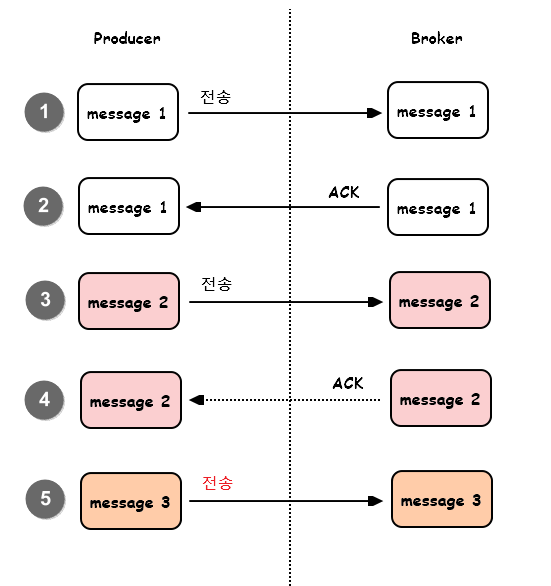

오늘은 카프카 프로듀서의 내부 동작과 구현에 대해서 알아보도록 하겠습니다.  
프로듀서가 전송하려는 메시지들은 프로듀서의 `send()` 메소드를 통해 serializer, 파티셔너를 거쳐 카프카로 전송됩니다.  

우선 이 파티셔너가 어떤 것인지 알아보는 것을 시작으로 프로듀서에 대해서 알아봅시다.  

<br>

# 파티셔너
- 카프카의 토픽은 병렬처리를 위해 여러개의 파티션으로 나뉩니다. 
- 그리고 프로듀서가 메시지를 전송하면 topic내에 있는 파티션에 로그 세그먼트를 저장하게 됩니다. 
- 이 때 <u>프로듀서가 어느 파티션에 메시지를 보내야할지 결정하는 것</u>을 지정해야하는데, 이 역할을 하는 것이 바로 **파티셔너**입니다.
- 프로듀서가 파티션을 결정하는 알고리즘은 기본적으로 메시지(레코드)의 키를 hash 처리해 파티션을 구하는 방식을 사용합니다. 
- hash table은 파티션의 크기에 따라 바뀌게 되며 멱등성이 제공되지 않으므로(항상 동일한 값이 나오지 않음) 주의해야 합니다. 그래서 가능하면 파티션의 개수를 변경하지 않는 것을 권장합니다. 
  - ex) user123(key)는 partition이 2개일때는 1번 partition으로, partition이 4개일때는 3번 partition에 mapping 될 수 있음.
- 파티셔너에서 message 분배를 하기 위한 2가지 전략이 있습니다. 라운드 로빈과 스티키 파티셔닝 전략이 이에 해당됩니다. 각각에 대해서 알아봅시다.

## 라운드 로빈, 스티키 파티셔닝 전략
1. 라운드 로빈 전략
   - Record 전송시 key 값은 필수값이 아니기에 Null로 전달이 가능합니다. 이 때 라운드로빈 방식으로 Record가 전송됩니다. 
   - 파티셔너는 브로커에 메시지를 전달하기 전에 **버퍼 메모리 영역에 message를 모아서 한번에 전달하는 batch 처리 방식**을 사용합니다. 라운드 로빈 방식은 버퍼에 무작위로 record를 전달하기 때문에 버퍼에 데이터가 차는 속도가 느리고 이로 인해 지연(latency)이 발생하게 됩니다.
   - 이러한 지연(latency)을 줄이기 위해 사용하는 것이 스티키 파티셔닝 전략입니다.
2. 스티키 파티셔닝 전략
   - 스티미 파티셔닝 전략은 Kafka 2.4 버전부터 지원하게 되었습니다.
   - 하나의 파티션에 레코드 수를 먼저 채워서 빠르게 카프카로 메시지를 전달하는 방식입니다. 
     - 아래 이미지를 보면 라운드 로빈과는 다르게 하나의 파티션에 먼저 메시지 3개를 채워넣어 데이터를 먼저 전달시킵니다.
   - 해당 방식은 기본 설정에 비해 **약 30% 이상 지연시간이 감소하고 CPU 사용률도 줄어드는 효과**를 얻었다고 합니다.


  
[출처] : <https://www.confluent.io/blog/apache-kafka-producer-improvements-sticky-partitioner/>

----
<br>

# 프로듀서의 배치(batch)
카프카에서는 토픽의 처리량을 높이기 위한 방법으로 **배치(Batch) 전송**을 권장합니다. 따라서 앞선 설명과 같이 배치 전송을 위해 버퍼를 사용하게 됩니다.

프로듀서는 배치 전송을 위해 다음과 같은 옵션들을 제공합니다.



|option|description|
|----|----|
|buffer.memory|카프카로 메시지들을 전송하기 위해 담아두는 프로듀서의 버퍼 메모리 옵션입니다. 기본값은 32MB로 필요에 따라 조절이 가능합니다.|
|batch.size|배치 전송을 위해 메시지들을 묶는 단위를 설정하는 옵션입니다. 기본값은 16KB 입니다. 이 속성을 통해 배치 크기를 더 높이거나 줄일 수 있습니다.|
|linger.ms|배치 전송을 위해 버퍼 메모리에서 대기하는 메시지들의 최대 대기시간을 설정하는 옵션입니다. 단위는 ms이며 기본값은 0입니다. 이는 배치 전송을 위해 기다리지 않고 메시지를 바로 전송하는 것을 뜻합니다.|

## 목적에 따른 설정값 변경
- 장점이 많다고 해서 무조건 배치처리를 해야하는 것은 아닙니다. 목적에 따라 달라집니다.
- 처리량을 높이려면 batch.size와 linger.ms의 값을 크게 설정합니다.
- 지연 없는 전송이 목표라면 batch.size와 linger.ms의 값을 작게 설정합니다.

## 주의 사항
- buffer.memory의 크기는 반드시 batch.size보다 커야합니다. 
- 위의 그림을 예시로 파티션의 크기가 3개라면 buffer.memory의 크기는 batch.size X 3 보다 큰 크기여야 합니다.

## 압축 기능 존재
- 배치 전송과 함께 압축기능을 사용하면 더욱더 효율적인 카프카 전송이 가능합니다.
- gzip, snappy, lz4, zstd 등의 압축포맷을 지원하고 **높은 압축율을 선호한다면 gzip, zstd**를 선택하고, **낮은 지연시간을 선호한다면 lz4, snappy**를 선택하는 걸 추천합니다.

---
<br>

# 중복 없는 전송
데이터 처리 업무를 담당하는 DE나 개발자에게는 중복 없는 전송이 매우 유용할 수도 있습니다. 예를 들면 온라인 쇼핑 서비스에 소비자의 구매 내역이 중복처리되어 동일한 제품이 소비자에게 두번 배송되거나 중복 결제가 발생한다면 이는 매우 큰 문제일 수 있기 때문입니다.

중복이 없는 전송을 알아보기전 메시지 시스템들의 메시지 전송방식에 대해 알아보겠습니다.

## 적어도 한번 전송(at-least-once)
아래 그림을 통해 설명 `적어도 한번 전송(at-least-once)`이 어떻게 진행되는지 알아보도록 하겠습니다.  



1. 프로듀서가 브로커의 특정 토픽으로 message1을 전송합니다.
2. 브로커는 message1을 기록하고, 잘받았다는 ACK를 프로듀서에게 응답합니다.
3. 브로커의 ACK를 받은 프로듀서는 다음 메시지인 message2를 브로커에게 전송합니다.
4. 브로커는 **message2를 기록**하고, 잘받았다는 ACK를 프로듀서에게 전송하려고 합니다. <u>하지만 네트워크 오류 또는 브로커 장애가 발생하여 결국 프로듀서는 message2에 대한 ACK를 받지 못합니다.</u>
5. message2를 전송한 후 브로커로부터 ACK를 받지 못한 프로듀서는 브로커가 message2를 받지 못했다고 판단해 message2를 재전송합니다.

현 상황을 다시 정리해보면 프로듀서 입장에서는 브로커가 메시지를 저장하고 ACK만 전송하지 못한건지, 메시지를 저장하지 못해서 ACK를 전송하지 않은 것인지는 정확히 알 수 없습니다. 

하지만 message2에 대한 ACK를 받지 못한 프로듀서는 `적어도 한번 전송` 방식에 따라 메시지를 다시한번 전송하게 됩니다. 그래서 **브로커에 message2가 이미 기록되어 있는 상태라면 한번 더 message2를 받게 되어 중복이 발생할 수도 있습니다.**

<br>

## 최대 한번 전송(at-most-once)
`최대 한번 전송`에서는 앞선 방식과 다르게 message2가 유실되었든 되지 않았든 신경쓰지 않고 곧바로 다음 message를 보내게 됩니다.  

위의 방식과의 차이로는 <u>message2의 ACK를 받지 못했음에도 불구하고 message3을 바로 전송</u>하는 것을 알 수 있습니다.  

**이 경우 중복은 발생하지 않으나 message가 유실될 수도 있습니다.**  
대량 로그 수집을 하거나 IOT 같은 환경에서 사용하곤 합니다.



<br>

## 중복 없는 전송

중복 없는 전송과정은 앞선 최소 한번 전송과 동일합니다.  
하지만 프로듀서가 message2를 다시 전송한 후 브로커의 동작에 차이가 있습니다.

**프로듀서가 재전송한 message2의 헤더에서 PID(0)와 message번호(1)을 비교해 message2가 이미 Borkder에 저장되어 있는 것을 확인한 브로커는 메시지를 중복 저장하지 않고 ACK**만 보내게 됩니다. 

이러한 브로커의 동작 덕분에 message는 중복을 피할 수 있게 됩니다.


PID는 사용자가 별도로 생성하는 것이 아닌 프로듀서에 의해 자동으로 생성되며 이 PID는 프로듀서와 카프카 사이에서 내부적으로만 이용되므로 사용자에게 별도로 노출되지 않습니다. 또한 메시지마다 부여되는 시퀀스 번호는 0번부터 시작해 순차적으로 증가합니다.  

프로듀서에서 시퀀스 번호를 메시지마다 순차적으로 증가시키는 방법과 동일하게, **브로커에서도 기록되는 메시지들에 대해 시퀀스 번호**를 증가시킵니다.

따라서 프로듀서가 보낸 메시지의 시퀀스 번호가 <u>브로커가 갖고 있는 시퀀스 번호보다 정확하게 하나 큰 경우가 아니라면, 브로커는 프로듀서의 메시지를 저장하지 않습니다.</u>

이렇게 <u>메시지 중복을 피하기 위해 사용하는 PID와 시퀀스 번호 정보는 브로커의 메모리에 유지되고 리플리케이션 로그</u>에도 저장됩니다. 따라서 예기치 못한 브로커의 장애 등으로 리더가 변경되는 일이 발생하더라도 **새로운 리더가 PID와 시퀀스 번호를 정확히 알 수 있으므로 중복 없는 메시지 전송이 가능합니다.**

이러한 사항은 결국 오버헤드가 존재할 수 밖에 없는데, 단순한 숫자 필드만 추가하는 방식으로 구현되었기 때문에 생각보다 높은 편은 아닙니다.  
confluent의 글에 따르면 기존 대비 최대 약20% 정도만 성능이 감소했다고 합니다.  

그래서 프로듀서 전송 성능에 그다지 민감하지 않은 상황에서 중복 없는 메시지 전송이 필요하다면 이 방식을 적용할 것을 권장합니다. 

## 중복없는 전송을 위한 프로듀서 설정

|option|value|description|
|----|----|----|
|enable.idempotence|true|프로듀서가 중복없는 전송을 허용할지 결정하는 option. 기본 값 false. true로 변경시 다음에 나오는 옵션들도 반드시 변경해야 함. 그렇지 않으면 ConfigException 발생.|
|max.in.flight.requests.per.connection|1~5|ACK를 받지 않은 상태에서 하나의 커넥션에서 보낼 수 있는 최대 요청수. 기본값은 5이며, 5이하로 설정해야 함.|
|acks|all|프로듀서 acks와 관련 옵션으로 기본값은 1이며, all로 설정해야 함.|
|retries|5|ack를 받지 못한 경우 재시도를 해야하므로 0보다 큰값으로 설정해야 함.|


----
<br>

# 정확히 한번 전송 (exactly-once)
데이터 처리나 가공 작업을 하는 대부분의 사람들은 데이터 파이프라인에서 메시지 중복이나 손실이 발생하지 않기를 원합니다.  
가장 이상적인 상황이라면 모든 메시지를 정확히 한번 처리해주기를 원합니다.  

은행의 사례로 들면 A 계좌에서 B 계좌로 돈을 송금한다면, A 계좌의 출금 이벤트와 B 계좌의 입금 이벤트 두가지로 나눌 수 있습니다.  
만약 출금 이벤트가 중복되어 두 차례 발생하거나, 출금 이벤트는 유실되고 입금 이벤트만 처리된다면 은행은 매우 곤란한 상황에 빠지게 됩니다.  

이처럼 애플리케이션에서 중복 없는 전송 혹은 정확히 한번 처리하는 기능을 제공한다면 개발자의 입장에서는 매우 반가운 일이 될 것 입니다.

그러나 이러한 정확히 한번 처리는 애플리케이션에서 구현하기 굉장히 어렵습니다.  
또 메시지를 처리하다보면 예상하기 힘든 다양한 변수들이 발생할 수 있어서 여러 조건이 붙게 됩니다.

카프카에서의 **정확히 한 번 전송(exactly-once)의 개념은 트랜잭션과 같은 프로세스 처리**를 뜻하며, 중복 없는 전송은 정확히 한 번 전송의 일부 기능이라 할 수 있습니다.

이 처리를 위한 별도의 프로세스를 **트랜잭션 API**라고 부릅니다.  
이러한 방식이 어떻게 구현되는지 살펴봅시다. 

## Transaction Design
프로듀서가 카프카로 정확히 한번 방식으로 메시지를 전송할때, 프로듀서가 보내는 메시지들은 원자적으로(atomic)하게 처리되어 전송에 성공하거나 실패합니다.  

구성 요소로는 다음과 같은 것들이 존재합니다.

- Transaction Coordinator : 프로듀서에 의해 전송된 메시지를 관리하고 현재 트랜잭션의 상태를 관리합니다. 주 역할을 Producer ID와 transactional.id를 매핑하고 해당 트랜잭션 전체를 관리하는 역할입니다. 
- __transaction_state : transaction 관리를 위한 카프카 내부 토픽입니다. 관련된 로그를 기록하기 위한 토픽이며 프로듀서가 직접 기록하지는 않고, 프로듀서가 Transaction Coordinator에 알리고, Transaction Coordinator가 직접 로그를 write하는 방식으로 관리됩니다.
- Control message : 트랜잭션을 사용하면 메시지가 정상적으로 커밋된 것인지, 실패된 것인지 식별할 수 있어야 합니다. 카프카에서는 이를 식별하기 위한 정보로서 control message라는 것을 사용합니다. payload에는 message의 value는 포함되지 않고 애플리케이션에 노출되지 않습니다. 컨트롤 메시지는 오직 브로커와 클라이언트 통신에서만 사용됩니다.

**Transaction ID는 프로듀서 별로 고유하게 설정되어야 합니다.** 만약 2개의 프로듀서가 있다면 이 두 프로듀서는 서로 다른 TransactionID를 가져야 합니다.

<u>Java 코드를 예시로 들면 Producer에서 아래와 같이 Trasnaction ID를 설정할 수 있는데, 
이 값은 프로듀서별로 고유해야 합니다.</u>

```java
props.setProperty(ProducerConfig.TRASACTIONAL_ID_CONFIG, "peter-transaction-01");
```

## 트랜잭션 API 동작 순서
1. 트랜잭션 코디네이터 찾기
   - 트랜잭션 코디네이터는 브로커에 위치합니다. 
   - 트랜잭션 코디네이터가 존재하지 않는다면 신규 트랜잭션 코디네이터를 생성합니다.
   - __transaction_state 토픽의 파티션 번호는 transactional.id를 기반으로 해시하여 결정되는데, 이 파티션의 리더가 있는 브로커가 트랜잭션 코디네이터의 브로커로 최종 선정됩니다.
   - 이는 transactional.id가 정확히 하나의 코디네이터만 갖고 있다는 의미와도 같습니다.
2. 프로듀서 초기화 동작
   - `InitTransactions()` 메소드를 이용해 트랜잭션 전송을 위한 InitPidRequest를 트랜잭션 코디네이터로 보냄.
   - 트랜잭션 코디네이터는 TID, PID를 매핑하고 해당 정보를 트랜잭션 로그에 기록.
   - 그런 다음 PID 에포크(epoch)를 한 단계 올리는 동작을 하게되고, PID 에포크가 올라감에 따라 이전의 동일한 PID와 이전 에포크에 대한 쓰기 요청은 무시.
3. 트랜잭션 시작
   - `beginTransaction()` 메소드를 이용해 새로운 트랜잭션의 시작을 알림.
   - 트랜잭션 코디네이터 관점에서는 첫 번째 레코드가 전송될때까지 트랜잭션이 시작된 것은 아님.
4. 트랜잭션 상태 추가
   - 트랜잭션 코디네이터에는 PID-PartitionIndex를 쌍으로 키를 만들어 status log를 write함.
   - 최초 status는 Ongoing 상태로 입력됨.
5. 메시지 전송
   - 다른 브로커에 위치한 message 전용 Leader Partition에 write.
6. 트랜잭션 종료 요청 동작
   - 메시지 전송을 완료한 프로듀서는 commitTransaction() 혹은 abortTransaction() 메소드 중 하나를 반드시 호출해야함. 
   - 완료시 트랜잭션 코디네이터는 PrepareCommit 혹은 PrepareAbort로 추가 기록. 
   - 완료 후 사용자 토픽에 커밋 표시를 기록함.
7. 트랜잭션 완료
   - 트랜잭션 코디네이터는 완료됨(Committed)이라고 트랜잭션 로그에 기록 후, 프로듀서에 알림.

<br>

# 참고자료
- 《실전 카프카 개발부터 운영까지》- 고승범 지음