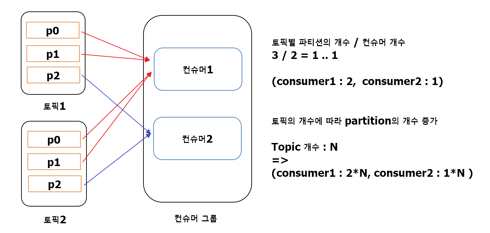
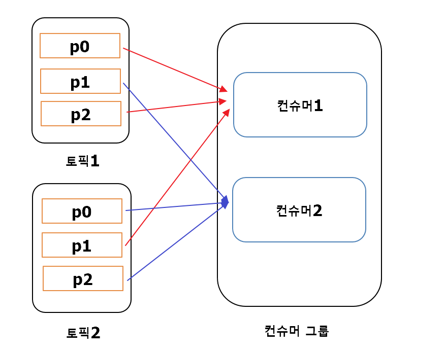
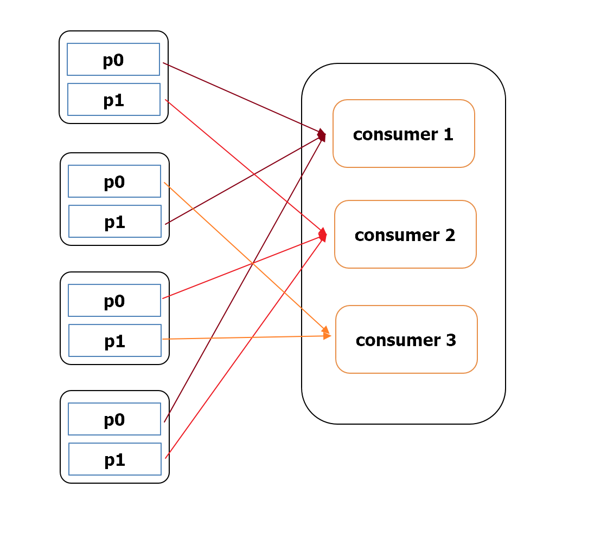
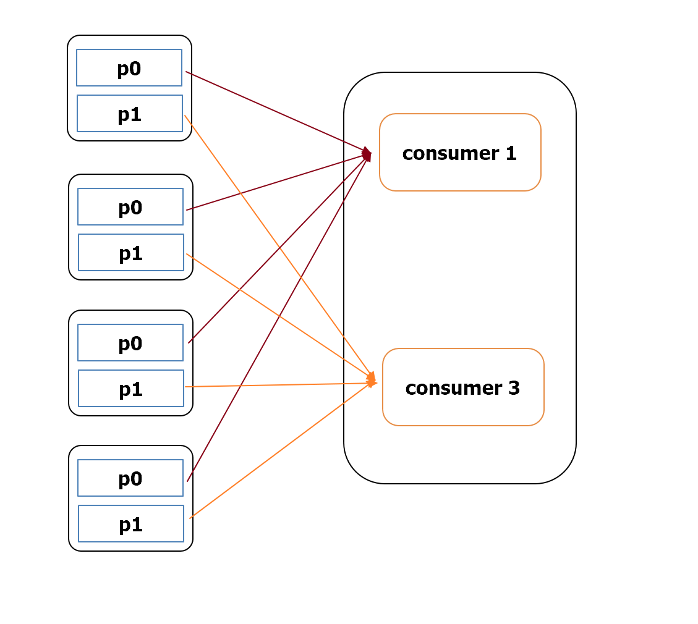

컨슈머는 프로듀서로부터 카프카에 전달된 메시지를 가져오는 역할을 합니다.  
카프카에 토픽-파티션 단위로 저장된 메시지를 정확하게 가져오는 것이 중요한 핵심 사항 중 하나입니다.

이번 장에서는 컨슈머가 어떤방식으로 동작하는 지에 대해 살펴보도록 하겠습니다.

# 1. 컨슈머 오프셋 관리
- 컨슈머의 동작 중 가장 핵심은 오프셋 관리라고 할 수 있음.
- 카프카는 항상 node의 장애를 염두하여 설계됟 프로그램이기 때문에 복구가 매우 중요함.
- 장애 발생시 기존 컨슈머의 역할을 대신할 경우를 위하여 message의 위치를 나타내는 offset이 존재.
- consumer는 그룹별로 offset을 저장하며 이에 관한 정보는 `__consumer_offsets` 토픽에 기록 됨.

## Consumer offset 관련 기본 동작

  

1. 2번 Offset 메시지 C까지 read.
2. 그 다음으로 읽어야 할 3번 Offset의 위치를 `__consumer_ofsets` 토픽에 저장.

## consumer offset 관련 properties setting 
- offsets.topic.num.partitions : default 50
- offsets.topic.replication.factor : default 3

----
<br>

# 2. 그룹 코디네이터
- 컨슈머 그룹 내의 각 컨슈머들은 서로 자신의 정보를 공유하면서 하나의 공동체로 동작.
- 컨슈머 그룹 내의 컨슈머들은 언제든지 자신이 속한 컨슈머 그룹에서 떠나거나 합류하는 것이 가능.
- 컨슈머 그룹에서 각 컨슈머들에게 작업을 균등하게 분해하는 동작을 **컨슈머 리밸런싱**이라고 함.
- 이를 컨트롤하기 위해 그룹마다 코디네이터가 하나씩 존재하는데 이를 **그룹 코디네이터** 부름.
- **그룹 코디네이터**의 목적은 컨슈머 그룹이 구독한 토픽의 파티션들과 그룹의 멤버들을 트래킹 하는것.
- 따라서 파티션 또는 그룹의 멤버에 변화가 생기면, 작업을 균등하게 재분배하기 위해 컨슈머 리밸런싱 동작이 발생.
- 이러한 그룹 코디네이터는 브로커 중 하나에 위치하게 됨.

  

## 컨슈머 그룹과 그룹 코디네이터의 동작 과정

  
[컨슈머 그룹과 그룹 코디네이터간의 동작 이미지]

1. 컨슈머는 컨슈머 설정값 중에서 bootstrap.brokers 리스트에 있는 브로커에게 컨슈머 클라이언트와 초기 커넥션을 연결하기 위한 요청을 보냄.
2. 요청을 받은 브로커는 그룹 코디네이터를 생성, 컨슈머에게 응답을 보냄. 컨슈머 그룹의 첫번째 컨슈머가 등록될때까지 아무 작업도 일어나지 않음.
3. 그룹 코디네이터는 group.initial.rebalance.delay.ms의 시간동안 컨슈머의 요청을 기다림
4. **컨슈머는 컨슈머 등록 요청을 그룹 코디네이터에게 보냄. 이때 가장 먼저 요청을 보내는 컨슈머가 컨슈머 그룹의 리더가 됨.**
5. 컨슈머 등록 요청을 받은 그룹 코디네이터는 **해당 컨슈머 그룹이 구독하는 토픽 파티션 리스트 등 리더 컨슈머의 요청에 응답을 보냄.**
6. 리더 컨슈머는 정해진 컨슈머 파티션 할당 전략에 따라 그룹내 컨슈머들에게 파티션을 할당한 뒤 그룹 코디네이터에게 전달.
7. 그룹 코디네이터는 해당 정보를 캐시하고 각 그룹 내 컨슈머들에게 성공을 알림
8. 각 컨슈머들은 각자 지정된 토픽 파티션으로부터 메시지들을 가져옴.

위와 같이 실제로 컨슈머 그룹은 그룹 코디네이터와 서로 긴밀하게 메시지를 주고받으며 안정적인 관리를 할 수 있도록 노력하는 것을 알 수 있습니다.

## 컨슈머 하트비트(heart beat)
- 컨슈머들은 현재 자신들이 속한 컨슈머 그룹을 leave 할수도, 새롭게 join 할수도 있음.
- 이러한 컨슈머 그룹의 변화들은 컨슈머 코디네이터에게 컨슈머가 join 혹은 leave 요청을 보냄으로써 자연스럽게 처리함.
- 하지만 <u>컨슈머가 장애로 leave 요청을 보내지 못할 경우,</u> 이를 감지할 수 있어야 하는데 이 때 사용되는 것이 **하트비트(heart beat)**임.

| consumer 옵션         | default 값 | 설명                                                                                                                                                                              |
| --------------------- | ---------- | --------------------------------------------------------------------------------------------------------------------------------------------------------------------------------- |
| heartbeat.interval.ms | 3000       | 그룹 코디네이터와 하트비트 인터벌 시간. 해당 시간은 session.timeout.ms보다 낮게 설정해야하며 1/3 수준이 적절.                                                                     |
| session.timeout.ms    | 10000      | 어떤 컨슈머가 특정 시간 안에 하트비트를 받지 못하면 문제가 발생했다고 판단해 컨슈머 그룹에서 해당 컨슈머는 제거되고 리밸런싱 동작이 발생.                                         |
| max.poll.interval.ms  | 300000     | 컨슈머는 주기적으로 poll()을 호출해 토픽으로부터 레코드들을 가져오는데, poll() 호출 후 최대 5분간 poll() 호출이 없다면 컨슈머가 문제가 있는 것으로 판단해 리밸런싱 동작이 일어남. |

----
<br>

# 3. 스태틱 멤버십
때로는 h/w 점검이나 sw update 등의 이유로 관리자는 컨슈머 그룹 내의 컨슈머들을 하나씩 순차적으로 재시작하고 싶은 경우가 있습니다. 하지만 위와 같이 하트비트를 설정할 경우 consumer의 down으로 리밸런싱이 발생하게 되고, 리밸런싱 중에는 컨슈머들이 일시 중지 되기 때문에 번거로운 상황이 올수도 있습니다.

대용량 메시지들을 처리하는 컨슈머 그룹이라면 리밸런싱 동작으로 인해 원래 상태를 복구하는데 상당한 시간이 소요될 수 있습니다.

때문에 이런 불필요한 리밸런싱을 방어하기 위해 v2.3부터 스태틱 맴버쉽(static membership)이라는 개념을 도입하게 됩니다.  
이것으로 인해 컨슈머가 재시작되더라도 리밸런싱이 발생되지 않게 됩니다.

## 스태틱 멤버십의 이점들
1. 기본적으로는 컨슈머 그룹에서 컨슈머가 떠날 때 리밸런싱이 일어나는데, 스태틱 맴버십이 적용된 컨슈머는 그룹에서 떠날 떄 그룹 코디네이터에게 알리지 않으므로 여기서 한번의 리밸런싱을 피할 수 있음.
2. 해당 컨슈머가 다시 합류할 때 그룹 코디네이터가 컨슈머의 ID를 확인하고 리밸런싱이 일어나는데, 이때도 기존 구성원임을 인지하므로 리밸런싱은 발생하지 않음.

## 적용시 유의사항
- session.timeout.ms를 기본값보다는 큰 값으로 조정해야 함. 그렇지 않을시 하트비트를 받지 못하여 강제로 리밸런싱이 발생.
- 만약 컨슈머가 재시작 시간이 총 2분 소요된다면, session.timeout.ms의 값을 2분 이상으로 설정해야함.

----
<br>

# 4. 컨슈머 파티션 할당 전략

앞서 알아본 프로듀서의 동작에서 파티셔너를 살펴본 적이 있습니다.  
파티셔너를 통해 레코드를 어느 토픽의 어느 파티션으로 이동시킬지 지정할 수 있었습니다.  

이와 동일하게 컨슈머도 어느 토픽의 어느 파티션에서 레코드를 가져올지 결정할 수 있습니다.  

## 레인지 파티션 할당 전략
- RangeAssignor는 파티션 할당 전략 중 default 값.
- **토픽별 파티션의 개수**와 컨슈머의 개수를 고려해서 파티션을 할당.
- 모든 토픽의 전체 파티션의 개수를 기준으로 분배하지 않기 때문에 불균등 분배가 발생함.
- 불균등하게 분배되기 때문에 특정상황에서만 사용하는 것이 좋음.
  - 동일한 레코드(msg)키를 사용하고 하나의 컨슈머 그룹이 동일한 파티션 수를 가진 2개 이상의 토픽을 컨슘할때 유용.
  - 즉, 각 토픽의 동일한 key를 가진 파티션을 하나의 컨슈머가 처리하게끔 구성한다면 사용을 생각해볼 수 있음.

  

## 라운드 로빈 파티션 전략
- RangeAssignor와 다르게 균등한 형태로 파티션을 분배하는 전략.
- 전체 토픽의 파티션을 차례대로 consumer에 분배하는 형태.

  


## 스티키 파티션 할당 전략
- 라운드 로빈 파티션 전략의 경우 rebalancing 될때 기존 토픽의 파티션이 다른 컨슈머에 할당될 수 있음.
  - 리밸런싱은 컨슈머가 down될때 발생하므로 가용 가능한 컨슈머의 개수가 변경되어 위치가 재할당.
- 불필요한 재할당을 줄이기 위해 <u>기존에 매핑된 파티션과 컨슈머를 최대한 유지</u>하는 전략.
- rebalancing 발생시 본래 연결된 topic-partition은 그대로 유지하고, 해제된 것에 대해서만 균형을 맞추어 분배하는 방식.
- roundrobin 에 비해 재할당이 작아 오류 발생시 효율적으로 복구 가능.

  
[그림 1] 최초의 할당 상태  

  
[그림 2] round robin 방식의 rebalancing  

  
[그림 3] sticky 방식의 rebalancing

## 협력적 스티키 파티션 할당 전략
-  스티키 파티션 할당 전략보다 한층 더 고도화된 스티키 파티션 할당 전략.
-  이제까지의 컨슈머 리밸런싱 동작은 내부적으로 EAGER라는 리밸런스 프로토콜을 사용했고 이것은 컨슈머에 할당된 모든 파티션을 항상 취소시킴.
   -  파티션을 컨슈머 그룹별로 하나만 연결되어야 함.
   -  그래서 파티션이 연결된 상태에서 다른 컨슈머에 연결하는 것은 불가능.
   -  때문에 어쩔 수 없이 파티션의 연결을 취소한 후 다른 컨슈머에 연결을 진행.
   -  그리고 그룹 내에서 여러 파티션들에 대해 소유권 변경 작업(새로운 파티션 할당 작업)이 동시에 이뤄져야하므로 로직을 단순하게 구성하기 위함.
   -  리소스를 많이 사용하는 컨슈머 그룹에서는 이러한 동작 중에 **다운타임이 많이 발생**하여 문제가 됨.
- 협력적 스티키 파티션 할당 전략에서는 EAGER가 아닌 COOPERATIVE 프로토콜을 적용하기 시작했고, 이 프로토콜은 리밸런싱이 동작하기 전의 컨슈머 상태를 유지할 수 있게 함.
  - 이것으로 인해 다운타임 없이 몇차례의 리밸런싱을 거쳐 파티션 재할당이 가능해짐.
- 상세 과정을 [confluent.io copperative-rebalancing](https://www.confluent.io/blog/incremental-cooperative-rebalancing-in-kafka/)을 참조.
- 이후 버전에서 파티션 할당 전략의 기본값으로 채택될 가능성이 높다고 함.

----
<br>

# 5. 정확히 한 번 컨슈머 동작

앞선 글에서 정확히 한번 보내는(트랜잭션) 프로듀서의 동작에 대해 소개된 적이 있습니다.  
이것을 정확히 한번만 받기 위해서 컨슈머에서도 설정을 해줘야 합니다. 

```java
props.setProperty(ConsumerConfig.ISOLATION_LEVEL_CONFIG, "read_committed");
```

위의 코드처럼 ISOLATION_LEVEL_CONFIG을 read_committed로 설정을 해주기만 하면 트랜잭션이 완료된 메시지에 대해서만 read를 할 수 있게 됩니다. ( default는 read_uncommitted임 )

