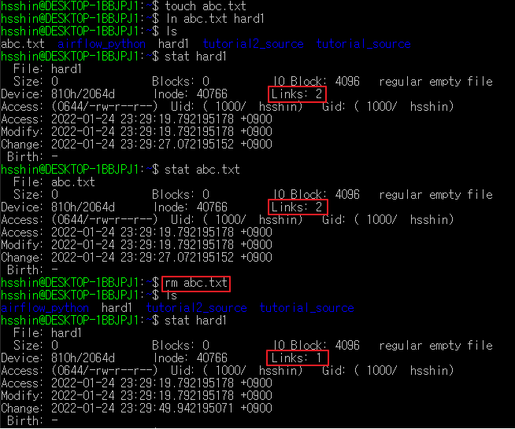

# iNode란?
- Linux에서 `ls -al` command를 통해 파일의 정보를 확인해보면 권한, 파일 형식 등등 다양한 정보들이 출력되는 것을 알 수 있습니다. 
- 이런 정보는 어디에 기록이 되고 있는 것인지 의문점을 가질 수 있는데, 이와 같이 각 **파일의 메타 데이터를 저장할때 사용되는 것이 inode** 입니다.
- `ls -i` command를 통해 inode의 number를 확인할 수 있습니다.
- iNode는 link를 통해 다른 file에서도 연결을 할 수 있습니다. Softlink와 Hardlink가 이에 해당되는데 아래에서 자세하게 알아보도록 하겠습니다.

    

    [image 참조] : https://pc-freak.net/images/what-is-inode-find-out-which-filesystem-or-directory-eating-up-all-your-system-inodes-linux_inode_diagram.gif

# link
- link라는 개념은 Window에서 흔히 사용하는 "바로가기"를 생각하면 됩니다. 바로가기는 특정 파일의 경로를 별도의 파일로 저장한 후에 Directory의 파일이나 폴더로 바로 이동하게 되는 기능입니다. 이와 비슷한 개념이 Linux에도 그대로 존재합니다.

## Hardlink
- 첫번째로 소개할 link는 Hardlink 입니다. Hardlink는 파일의 inode를 직접 연결해서 바로가기를 걸어두는 것을 의미합니다. 
- 직접 inode에 연결되어 있기 때문에 최초로 생성한 파일을 삭제하더라도 실제 File Data는 삭제되지 않습니다.
- `ln "원본파일" "생성할 link 파일"` command를 통해 Hardlink를 생성할 수 있습니다.
  
    

## Softlink
- Softlink는 Hardlink와는 다르게 링크한 파일의 경로만 저장합니다.
- 저장한 Directory의 파일이 제거된다면 Softlink 또한 사용할 수 없는 상태가 됩니다.
- 원본 파일 제거 후, 동일한 경로에 동일한 name으로 파일을 다시 생성하면 다시 Softlink 동작이 가능합니다.
- Softlink는 symbolic link, symlink 라고도 불립니다.
- `ln -s "원본파일" "생성할 link 파일"` command를 통해 Softlink를 생성할 수 있습니다.
    

    [image 참조] : https://miro.medium.com/max/628/1*ojVZedoItdtM1OEpl9YatQ.png