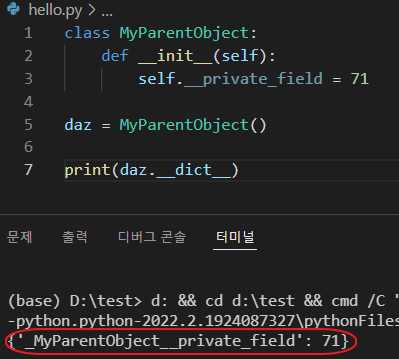
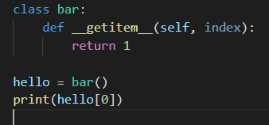

## CHAPTER 5. 클래스와 인터페이스

### 37. 내장 타입을 여러 단계로 내포시키기보다는 클래스를 합성하라

dict()을 통해서 학생들의 점수를 관리하는 프로그램이 있다고 하자. 
여기에 과목별 점수, 과목별 점수 + 가중치 등등에 대해서도 관리가 가능하도록 프로그램 변경을 요청받았을때

dict()을 통해 계속해서 위의 정보들을 추가하면 프로그램이 점점 복잡해진다.
이를 방지하기 위해 클래스를 사용해 서로 합성할 수 있도록 모듈화를 시키고 필요에 따라서는 named tuple도 이용해서
변경에 유연하게 대처할 수 있도록 구조를 만들어 나가라는 내용.

<br>

### 38. 간단한 인터페이스의 경우 클래스 대신 함수를 받아라

제목만 보면 무슨소리인가 싶을 수도 있는데, defaultdict을 좀 더 python 스럽게 사용하는 방법에 대한 설명이다.
defaultdict을 사용할때 첫번째 인자로 자료형대신에 함수도 넣을 수 있는데, 이에 대한 내용이다.

예시로는 defaultdict에 function을 기본값으로 주고 거기에 부수 효과를 삽입할때 (키가 없는 경우가 몇번이였는지..?) 어떻게 구현해야하는가에 대한 best practice를 제시해준다.
이 책을 통해 다시한번 느끼게 되는 것은 프로그래밍 언어도 의사 소통이 가능한 언어라는 것이다. 책 내용을 이해하기보다는 소스를 한번 보는 것이 내용 이해에 더 도움이 되는 것 같다. 번역을 디스하는게 아니냐고 물어본다면 그것이 맞다.

**- Code**
```python
from collections import defaultdict

def log_missing():
    print('키 추가됨')
    return 0

current = {'초록' : 12, '파랑' : 3}
increments = [
    ('빨강', 5 ),
    ('파랑', 17),
    ('주황', 9),
]

# defaultdict은 함수로 보내서 return 값을 붙이는 형태로도 사용이 가능하다.
# 두번째 인자에는 default 값을 넣어주는 것도 가능.
result = defaultdict(log_missing, current)
print('이전:', dict(result))
for key, amount in increments :
    result[key] += amount
print('이후:', dict(result))

# 여기서 키가 몇번 추가되었는지 체크를 하고 싶다면..?
class BetterCountMissing:
    def __init__(self):
        self.added = 0

    # __call__을 정의해서 callable 클래스로 만들어주자
    def __call__(self):
        self.added += 1
        return 0

# counter() 라고 호출하면 __call__ 함수를 통해 0이 return 됨을 알 수 있다.
counter = BetterCountMissing()
assert counter() == 0
assert callable(counter)

# 이것은 defaultdict에 넣으면 매번 call할때 self.added의 값이 +1 이 되므로 key 불일치 횟수를 쉽게 알수있다.
counter = BetterCountMissing()
result = defaultdict(counter, current)
for key, amount in increments :
    result[key] += amount
assert counter.added == 2
```

**- Result**
```text
이전: {'초록': 12, '파랑': 3}
키 추가됨
키 추가됨
이후: {'초록': 12, '파랑': 20, '빨강': 5, '주황': 9}
```

<br>

### 39. 객체를 제너릭하게 구성하려면 @classmethod를 통한 다형성을 활용하라.

예제에서는 map-reduce에 관한 구현을 예시로 들고있다.
Worker와 InputData를 사용해서 이를 표현하려 했고 Worker는 InputData를 통해 파일을 받아오는 방식(read) 으로 구현이 되어있다.


아래 Code 1 을 보면 하위클래스들에 따라 매번 새로운 구현이 추가되어야해서 변경에 취약한 구조를 가지고 있다. 예를 들면 generate_inputs 함수나 create_workers 함수는 PathInputData와 LinecounterWorker를 직접 호출하기 때문이다.

이를 좀 더 Generic하게 대응하기 위해서 책에서는 classmethod를 사용한 code2의 방식을 사용하도록 권장하고 있다.

code 2는 부모 클래스 혹은 자식 클래스에 **classmethod를 사용해서 하위 클래스 자신을 반환할 수 있게**하는 구조로 되어있다. ( cls 사용하는 부분들을 참고 )

**- Code 1.**
```python
class InputData:
    def read(self):
        raise NotImplementedError

class PathInputData(InputData):
    def __init__(self, path):
        super().__init__()
        self.path = path

    def read(self):
        with open(self.path) as f:
            return f.read()

class Worker:
    def __init__(self, input_data):
        self.input_data = input_data
        self.result = None
    
    def map(self):
        raise NotImplementedError

    def reduce(self, other):
        raise NotImplementedError

class LineCountWorker(Worker):
    def map(self):
        data = self.input_data.read()
        self.result = data.count('\n')

    def reduce(self, other):
        self.result += other.result


import os

def generate_inputs(data_dir):
    for name in os.listdir(data_dir):
        yield PathInputData(os.path.join(data_dir,name))

def create_workers(input_list):
    workers = []
    for input_data in input_list:
        workers.append(LineCountWorker(input_data))
    return workers

from threading import Thread

def execute(workers):
    threads = [Thread(target=w.map) for w in workers ]
    for thread in threads: thread.start()
    for thread in threads: thread.join()

    first, *rest = workers
    for worker in rest:
        first.reduce(worker)
    return first.result

def mapreduce(data_dir):
    inputs = generate_inputs(data_dir)
    workers = create_workers(inputs)
    return execute(workers)

import random
import shutil
def write_test_files(tmpdir):
    if os.path.exists(tmpdir):
        shutil.rmtree(tmpdir)
    
    os.makedirs(tmpdir)
    for i in range(100):
        with open(os.path.join(tmpdir, str(i)), 'w') as f:
            f.write('\n' * random.randint(0,100))


tmpdir = 'test_inputs'
write_test_files(tmpdir)

result = mapreduce(tmpdir)
print(f'총 {result} 줄이 있습니다.')

```

**- Code 2.**
```python
import os
from threading import Thread

class GenericInputData:
    def read(self):
        raise NotImplementedError

    @classmethod
    def generate_inputs(cls, config):
        raise NotImplementedError

class PathInputData(GenericInputData):
    def __init__(self, path):
        super().__init__()
        self.path = path

    def read(self):
        with open(self.path) as f:
            return f.read()

    @classmethod
    def generate_inputs(cls, config):
        data_dir = config['data_dir']
        for name in os.listdir(data_dir):
            yield cls(os.path.join(data_dir, name))

class GenericWorker:
    def __init__(self, input_data):
        self.input_data = input_data
        self.result = None

    def map(self):
        raise NotImplementedError

    def reduce(self):
        raise NotImplementedError

    @classmethod
    def create_workers(cls, input_class, config):
        workers=[]
        for input_data in input_class.generate_inputs(config):
            workers.append(cls(input_data))
        return workers

class LineCounterWorker(GenericWorker):
    def map(self):
        data = self.input_data.read()
        self.result = data.count('\n')

    def reduce(self, other):
        self.result += other.result

def execute(workers):
    threads = [Thread(target=w.map) for w in workers ]
    for thread in threads: thread.start()
    for thread in threads: thread.join()

    first, *rest = workers
    for worker in rest:
        first.reduce(worker)
    return first.result

def mapreduce(worker_class, input_class, config):
    workers = worker_class.create_workers(input_class, config)
    return execute(workers)

tmpdir = 'test_inputs'
config = {'data_dir' : tmpdir}
result = mapreduce(LineCounterWorker, PathInputData, config)
print(f'총 {result} 줄이 있습니다.')

```

<br>

### 40. super로 부모 클래스를 초기화하라
클래스를 상속을 받았을때 부모 클래스를 초기화하는 방식은 두가지가 있다.
첫번째는 super()를 사용하는 방법, 두번째는 부모 클래스의 `__init__` 을 직접 호출하는 방식이다.

해당 장에서는 두번째 방식으로 호출했을때의 문제점과 super()를 사용하지 않았을때 발생할 수 있는 여러 문제점들에 대해서 예시로 제시해준다.

**- Code**
```python
class MyBaseClass:
    def __init__(self, value):
        self.value = value

class TimesSevenCorrect(MyBaseClass):
    def __init__(self, value):
        super().__init__(value)
        self.value *= 7

class PlusNineCorrect(MyBaseClass):
    def __init__(self, value):
        super().__init__(value)
        self.value += 9

class GoodWay(TimesSevenCorrect, PlusNineCorrect):
    def __init__(self, value):
        super().__init__(value)

foo = GoodWay(5)
print("Times Seven Correct -> PlusNineCorrect 순으로 했으니 (5*7)+9 = 45가 나와야할 것 같다.")
print(f"하지만 답은? {foo.value=}")

mro_str = ', '.join(repr(cls) for cls in GoodWay.mro())
print("__init__의 호출순서:", mro_str)

# 호출순서: <class '__main__.GoodWay'>,<class '__main__.TimesSevenCorrect'>,<class '__main__.PlusNineCorrect'>,<class 
# '__main__.MyBaseClass'>,<class 'object'>

# 인자로 넘긴 것의 뒤에서부터 앞으로 계산이 되기 때문에 5*(7+9) = 89가 되는 것임!
```

**- Result**
```text
Times Seven Correct -> PlusNineCorrect 순으로 했으니 (5*7)+9 = 45가 나와야할 것 같다.
하지만 답은? foo.value=98
호출순서: <class '__main__.GoodWay'>,<class '__main__.TimesSevenCorrect'>,<class '__main__.PlusNineCorrect'>,<class 
'__main__.MyBaseClass'>,<class 'object'>
```

<br>

### 41. 기능을 합성할 때는 믹스인 클래스를 사용하라
무슨 말을 하려고 하는지는 모르겠음. 이해하기가 너무 어려워서 패스.

<br>

### 42. 비공개 애트리뷰트보다는 공개 애트리뷰트를 사용하라
파이썬에서는 변수 앞에 `__` 을 붙임으로써 attribute의 private을 제공한다. 
원리는 간단하다. `self.__private_field` 라고 선언을 한다면 이것을 `ClassName__private_field` 로 바꿔서 기존 변수의 이름으로는 접근하지 못하도록 한다.



그래서 위의 규칙만 알고있다면 private이 비공개가 아니게 된다는 점이다. 이런 특이사항은 python의 motto인 *"우리는 모두 책임질줄 아는 성인이다"* 으로 인해 생긴 것이라고 한다.

private으로 막아두면 나중에 다른 사람들이 필요할때 아예 사용 자체를 못하게 되어서 그건 아니라고 판단되서 이렇게 했다고 한다. 대신에 protected_field를 사용해서 "이 필드를 사용할 경우에는 조심해야 한다." 는 의미를 남긴다. 물론 이는 PEP-8 스타일 가이드의 관례적 사용법이다.

책에서는 private을 사용한다면 공개 API에 있는 것을 한정으로만 사용하라고 명시되어 있다. 공개 API는 사용자가 직접 수정하는 것이 어려우므로, 해당 클래스를 상속했을때 naming이 겹치는 문제를 방지하기 위해 이를 사용하라고 권장하고 있다.

결론만 말하자면 공개하고 싶지 않은 정보는 private 대신 protected를 사용하고 하위 클래스에서 name 충돌을 발생시키지 말아야하는 경우에 대해서만 private를 사용할 궛을 권한다.

<br>

### 43. 커스텀 컨테이너 타입은 collections.abc를 상속하라

python에서는 컨테이너를 상속받아서 기능 구현을 하는 일이 많다고 한다.
예를 들면 본래의 list에서 index 기능이 제공되지 않는다고 가정하면, list를 상속받아 이와 관련된 func을 추가하는 방식 등으로 말이다.

아래 이미지와 같이 list 처럼 index 기능을 구현하고 싶다면 magic method인 `__getitem__`을 구현해야 한다.



이같이 Custom Container Class를 만들고 싶을때는 collections의 abc를 사용해 구현에 필요한 인터페이스를 상속받는 것이 좋다. 해당 모듈에 있는 인터페이스를 상속 받은 후, 구현을 하지 않으면 에러가 발생하기 때문에 사전에 문제 발생을 차단할 수 있다.

상세 항목들에 대해서는 아래의 링크를 참조하자.

collection.abc : [https://docs.python.org/ko/3/library/collections.abc.html#collections-abstract-base-classes](https://docs.python.org/ko/3/library/collections.abc.html#collections-abstract-base-classes)

**- Code**
```python
from collections.abc import Sequence

class badType(Sequence):
    pass

foo = badType()
```

**- Result**
```text
Traceback (most recent call last):
  File "d:\test\hello.py", line 6, in <module>
    foo = badType()
TypeError: Can't instantiate abstract class badType with abstract methods __getitem__, __len__
```

<br>

### xx. Template

**- Code**
```python

```

**- Result**
```text

```

<br>
