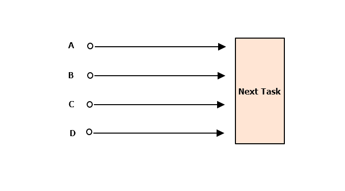

## 52. 자식 프로세스를 관리하기 위해 subprocess를 사용하라
subprocess는 python에서 child process를 관리하기 위해 사용하는 built-in 모듈.  
책에서는 `subprocess.Popen`을 사용해 관리할 것을 권유하고 있으며 기본적인 사용방법은 <https://docs.python.org/ko/3/library/subprocess.html> 링크에 있음.

한 가지 유의할 점은 `communicate`를 사용하기 전 buffer를 close하면 바로 프로그램이 실행이 된다는 점을 주의. stdin은 왠만하면 직접 건드리지 않는 것이 좋을듯.  

**- Code**
```python
import subprocess
import os

def run_encrpy(data):
    # 여기서 env는 환경변수를 뜻함.
    env = os.environ.copy()
    env['password'] = 'zf7ShyBhgZ0raQDdE/FiZpm/m/8f9X+M1'

    proc = subprocess.Popen(
        ['openssl', 'enc', '-des3', '-pass', 'env:password'],
        env=env, 
        stdin=subprocess.PIPE,
        stdout=subprocess.PIPE)

    proc.stdin.write(data)
    proc.stdin.flush()
    return proc

def run_hash(input_stdin):
    return subprocess.Popen(
        ['openssl', 'dgst', '-whirlpool', '-binary'],
        stdin=input_stdin,
        stdout=subprocess.PIPE)


encrpyt_procs = []
hash_procs = []

for _ in range(3):
    data = os.urandom(100)

    encrpyt_proc = run_encrpy(data)
    encrpyt_procs.append(encrpyt_proc)

    hash_proc = run_hash(encrpyt_proc.stdout)
    hash_procs.append(hash_proc)

    encrpyt_proc.stdout.close()
    encrpyt_proc.stdout = None

for proc in encrpyt_procs:
    proc.communicate()
    assert proc.returncode == 0

for proc in hash_procs :
    # communicate는 stdout, stderr를 반환한다.
    # 이는 앞서 stdout을 subprocess.PIPE로 설정해서 그런 것임.
    out, _ = proc.communicate()
    print(out[-10:])

assert proc.returncode == 0
```

**- Result**
```text
*** WARNING : deprecated key derivation used.
Using -iter or -pbkdf2 would be better.
*** WARNING : deprecated key derivation used.
Using -iter or -pbkdf2 would be better.
*** WARNING : deprecated key derivation used.
Using -iter or -pbkdf2 would be better.
b'b\x05\xa4\x8eT1\x19\x18\x14\xd0'
b'\xb9\xa4\xa7*\x8e\xee\x10\x80\\\xbe'
b'\xd0\xe9\xa1?\xc3[\xf4d\xbe\xda'
```

## 53. 블로킹 I/O의 경우 스레드를 사용하고 병렬성을 피하라
Python은 코드 실행시 GIL(Global interpreter Lock)을 사용하기 때문에,  
Thread 사용시 일반적인 경우에 다른 언어들이 취할 수 있는 이점을 취할 수 없다. 

단 한가지 이점이 생길 수 있는 경우가 있는데, 그것은 Blocking I/O가 진행될때이다.  
이 때는 CPU Bound Task가 아니기 때문에 switching이 많이 발생하지 않아 문제가 되지 않는다.  

`coroutine`, `asyncio` 같은 다른 대안들도 있으나 Threading이 직관적이기 때문에 Blocking I/O 사용시에만 Thread를 사용하자.  

```python
def factorize(number):
    for i in range(1, number + 1):
        if number % i == 0:
            yield i

import time

numbers=[2139079, 1214759, 1516637, 1852285]
start = time.time()

for number in numbers:
    list(factorize(number))

end = time.time()
delta = end - start
print(f'{delta=:.3f}')

from threading import Thread
class FactorizeThread(Thread):
    def __init__(self, number):
        super().__init__()
        self.number = number

    def run(self):
        self.factors = list(factorize(self.number))

start = time.time()

threads = []
for number in numbers:
    thread = FactorizeThread(number)
    thread.start()
    threads.append(thread)

for thread in threads:
    thread.join()

end = time.time()
delta = end - start
print(f'{delta=:.3f}')
```

## 54. 스레드에서 데이터 경합을 피하기 위해 Lock을 사용하라
앞서 언급된 GIL로 인해서 보통의 경우에도 Thread safe가 보장된다고 생각한다면 그렇지 않다.  
물론 어느정도 보장이 되는 컨테이너도 있을 수 있지만 그렇지 않다.

이것은 `+=` 연산 도중 내부 동작은 여러가지로 나뉘게 되는데 이때 thread별 ProgramCounter는 thread 시작시 트랜잭션 처리되지 않기 때문에 switching 발생시에 mutex 보장을 해주지 않기 떄문이다. GIL은 refer counter 등을 보장해줄 뿐 실제 이런 연산에 대해서는 thread safe 하게 동작되지 않는다.  

그래서 Lock을 사용해서 mutex를 걸어주면 data 영역에 대해서 thread safe를 보장해준다.  

```python
from threading import Thread

class Counter:
    def __init__(self):
        self.count = 0
    
    def increment(self, offset):
        self.count += offset

def worker(sensor_index, how_many, counter):
    for _ in range(how_many):
        counter.increment(1)


how_many = 10**6
counter = Counter()

threads = []
for i in range(5):
    thread = Thread(target=worker, 
                    args=(i, how_many, counter))
    threads.append(thread)
    thread.start()

for thread in threads:
    thread.join()

expected = how_many * 5
found = counter.count
print(f'{expected=}, {found=}')
```

```text
expected=5000000, found=2988814
```

```python
from threading import Thread, Lock

class Counter:
    def __init__(self):
        self.lock = Lock()
        self.count = 0
    
    def increment(self, offset):
        with self.lock:
            self.count += offset
```

```text
expected=5000000, found=5000000
```

## 55. Queue를 사용해 스레드 사이의 작업을 조율하라
- thread 작업을 통제하기 위해 Queue 모듈을 사용하라는 내용.
- Queue 모듈 사용시에 아래의 이점들을 얻을 수 있음.
  - busy-wating (반복문으로 종료 체크) 방지
  - Worker에서 run을 무한히 반복하지 않아도 됨.
  - Queue에 진행이 막힐 때, 크기가 커져서 메모리를 많이 사용하는 경우.

설명이 조금 과한거 같은데 번역도 엉망인거 같아서 일단 pass.

## 56. 언제 동시성이 필요할지 인식하는 방법을 알아두라
콘웨이의 생명 게임이라는 것을 예시로 보여준다. 
5x5의 cell이 있고, 각 셀의 상태는 alive, empty로 나타낸다.  

각 셀마다 근접한 셀의 상태가 alive인지 empty인지에 따라 cell을 empty로 바꿀것인지 alive로 바꿀 것인지 결정하는 게임이다.

<u>동시성을 조율하는 가장 일반적인 방법으로 Fan-in, Fan-out이 있다.</u>

- fan-in : 전체를 조율하는 프로세스안에서 다음 단계로 진행하기 전에 동시 작업 단위의 작업이 모두 끝날때까지 기다리는 과정을 팬인(Fan-in)이라고 한다.
- fan-out : 각 작업 단위에 대해 동시 실행되는 여러 실행 흐름을 만들어내는 과정을 팬아웃(fan-out)이라고 한다.

글로만 보면 이해가 잘 안되는데 그림을 그려보면 이해가 쉽다. 이 책은 번역이 어색해서 나의 생각을 다시한번 정리하게 해줘서 참 좋은 것 같다.



A,B,C,D단계는 Next Task로 가기전 실행이 된다. 이러한 실행의 흐름을 **Fan-out** 이라고 한다.  
Next Task는 일을 진행하기 전 A,B,C,D단계를 수행해야 한다. 다음 단계로 가기 전에 진행되어야 하고 이를 기다리는 것을 **Fan-in** 이라고 한다.

