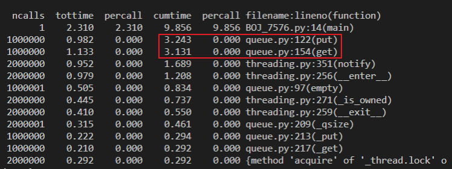
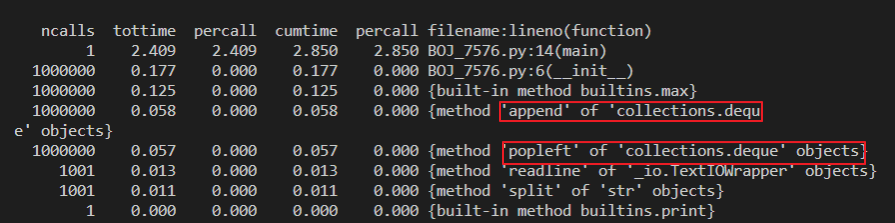

최근 BFS를 다시 볼일이 생겨서 백준 문제를 하나 풀어보게 되었다.  
<https://www.acmicpc.net/problem/7576> 문제인데 타임오버가 계속해서 발생하였다.

해설을 찾아봐도 내가 생각한 솔루션과 큰 차이가 없었는데도 타임오버가 계속 발생하여 결국 프로파일링을 하게 되었는데 `from queue import Queue` 사용으로 인해 타임오버가 발생함을 알 수 있었다.

아래는 Queue 사용시 시간 소요에 대한 프로파일링 결과이다. 
  

put과 get을 할때 대부분의 시간을 소요함을 알 수 있다. 반대로 덱(deque)를 사용했을때는 어떨까?  

  

보는 바와 같이 append 할때와 popleft를 할때의 속도는 Queue와 비교했을때 압도적으로 빠름을 알 수 있다.  

왜 이런차이가 발생하는 것일까? 아래는 python 공식 library page에 있는 Queue에 대한 설명이다.

> The queue module implements multi-producer, multi-consumer queues. **It is especially useful in threaded programming when information must be exchanged safely between multiple threads**. The Queue class in this module implements all the required locking semantics.  
 
[출처] : <https://docs.python.org/3/library/queue.html>

위의 언급과 같이 python에서 사용하는 Queue는 multi-thread를 안전하게 사용하기 위한 자료형으로 내부에서 thread safe하게 동작하기 위한 별도의 과정을 거치게 된다. 

Queue에 대한 프로파일링을 자세하게 보면 내부에서 `__enter__`, `__exit__` 등 다양한 함수들이 시간을 차지하는데 이런 것들이 thread safe를 위한 내부 구현에 해당된다.

그밖에도 Queue는 get을 호출할때 task가 존재하지 않는다면 대기 모드로 진입하는 등 다양한 작업을 보장하고 있다.  
그래서 우리가 일반적으로 생각하는 Queue를 사용하려면 `queue` 모듈이 아닌 collections의 [deque]((https://docs.python.org/3/library/collections.html?highlight=deque#deque-objects))를 사용해야 한다.  
deque에서의 popleft, append는 queue의 pop 및 push에 해당된다.  

python에서 container 사용시에는 이런 상황을 염두해두고 조심스럽게 접근할 필요가 있다. (´。＿。｀)