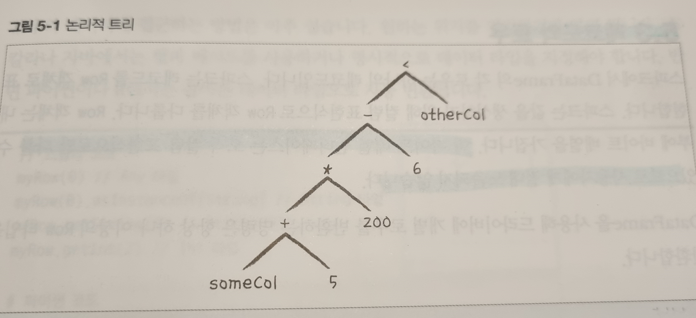
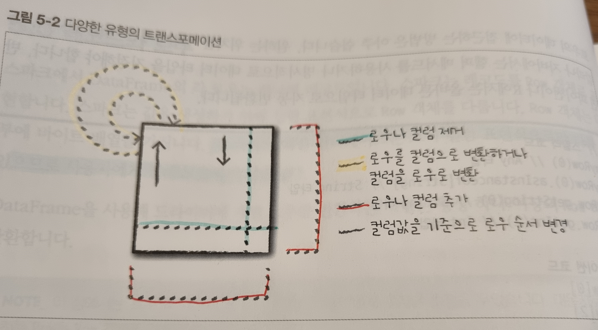

# Chapter 5. 구조적 API의 기본 연산

기본연산을 알아보기 전에 몇가지 단어에 대해서 살펴봅시다.

- 레코드 : DataFrame을 구성하는 Row.
- 컬럼 : 각 레코드에 수행할 연산 표현식을 나타냄.
- 스키마 : 각 컬럼명과 데이터 타입을 정의함.
- 파티셔닝 : Dataframe, Dataset이 클러스터에서 물리적으로 배치되는 형태를 정의함.
- 파티셔닝 스키마 : 파티션은 배치하는 방법을 정의함.
    - 분할 기준은 특정 컬리안 비결정론적 값을 기반으로 설정할 수 있음.
    

# 5.1 스키마

- DataFrame의 컬럼명과 데이터 타입을 정의함. 데이터소스에서 스키마를 얻거나 직접 정의할 수 있음.

<aside>
⚠️ 비정형 분석 ( ad-hoc analysis ) 에서는 스키마 - 온 - 리드가 대부분 잘 동작하지만, Long 데이터 타입을 Integer 데이터 타입으로 잘못 인식하는 등의 정밀도 문제가 발생할 수 있음. ( CSV, JSON ) 

운영환경에서 ETL 작업을 하는데 Spark를 사용한다면 직접 스키마를 정의해야 함. CSV나 JSON등의 데이터 소스를 사용하는 경우 스키마 추론과정에서 읽어들인 샘플 데이터 타입에 따라 스키마를 결정하기 때문에 정밀도 문제가 발생함!

</aside>

- 아래의 코드를 통해 데이터 소스에서 스키마 확인이 가능하다.

```python
spark.read.format("json").load("/data/flight-data/json/2015-summary.json").schema

# StructType(List[StructField] ) 데이터 반환
```

- 스파크는 런타임에 데이터 타입이 스키마의 데이터 타입과 일치하지 않으면 오류를 발생시킴.
    
    아래와 같이 Type을 직접 지정해서 Load가 가능함.
    

```python
from pyspark.sql.types import StructField, StructType, StringType, LongType

myManualSchema = StructType([
  StructField("DEST_COUNTRY_NAME", StringType(), True),
  StructField("ORIGIN_COUNTRY_NAME", StringType(), True),
  StructField("count", LongType(), False, metadata={"hello":"world"})
])
df = spark.read.format("json").schema(myManualSchema)\
  .load("/data/flight-data/json/2015-summary.json")
```

# 5.2 컬럼과 표현식

- 스파크의 컬럼은 표현식을 사용해 레코드 단위로 계산한 값을 단순하게 나타내는 논리적인 구조임. 따라서 컬럼의 실제값을 얻으려면 로우가 필요하고 로우를 얻으려면 DataFrame이 필요. DataFrame을 통하지 않으면 외부에서 컬럼에 접근할 수 없음.
- 컬럼 내용을 수정하려면 반드시 DataFrame의 스파크 트랜스포메이션을 사용해야 함.

## 5.2.1 컬럼

- col 함수나 column 함수를 사용하는 것이 가장 간단함.
- 컬럼이 DataFrame에 있을지 없을지는 알 수 없음.
    - 컬럼은 컬럼명을 카탈로그에 저장된 정보와 비교하기 전까지는 미확인 상태로 남음.
    - 관련 내용은 4장에 컴파일 과정 참고

```python
from pyspark.sql.functions import col, column
col("someColumnName")
column("someColumnName")
```

### 명시적 컬럼 참조

- DataFrame의 컬럼은 col 메서드로 참조가 가능함.
- col 메서드는 조인 시 유용하게 사용 가능.
- col 메서드를 사용해 명시적으로 컬럼을 정의하면 스파크는 분석기 실행 단계에서 컬럼 확인 절차를 생략함.

```python
df.col("count")
```

## 5.2.2 표현식

- 앞서 DataFrame을 정의할 때 컬럼은 표현식이라고 하였음. ****
- **표현식** 이란 DataFrame 레코드의 여러 값에 대한 트랜스포메이션 집합을 의미함.
- 특정 단일 Value를 얻기 위해 레코드에 적용하는 함수라고 생각하면 됨.
- 표현식은 expr 함수로 간단하게 사용이 가능함. 이 함수를 사용해 DataFrame의 컬럼을 참조할 수 있음.
    - expr ( "someCol" ) 은 col ( "someCol" ) 구문과 동일하게 동작
    

### 표현식으로 컬럼 표현

- expr 또는 col 함수를 통해 표현식을 나타낼 수 있음.
    - expr ( "someCol - 5" ) , col ( "someCol" ) - 5 , expr ( "someCol" ) - 5 는 모두 같은 트랜스포메이션 과정을 거침.
        
        ⇒ 스파크에서 연산 순서를 지정하는 논리적 트리로 컴파일을 하는데, 동일한 결과가 나옴.
        
        
        
- 위의 내용이 이해가 잘 되지 않을 수 있는데, 기억해야할 핵심 내용은 다음과 같음.
    - **컬럼은 단지 표현식일 뿐입니다.**
    - **컬럼과 컬럼의 트랜스포메이션은 파싱된 표현식과 동일한 논리적 실행 계획으로 컴파일됩니다.**
        
        ```python
        from pyspark.sql.functions import expr, col
        
        (((col("someCol") + 5 ) * 200 ) - 6 ) < col ("otherCol")
        expr("(((someCol + 5 ) * 200 ) - 6 < otherCol" )
        ```
        
    

### DataFrame 컬럼에 접근하기

- printSchema 메서드로 DF의 컬럼 전체 정보를 확인할 수 있으나, 프로그래밍 방식으로 컬럼에 접근할 때는 DataFrame의 Columns 속성을 사용함.

```python
spark.read.format("json").load("/data/flight-data/json/2015-summary.json").columns
```

# 5.3 레코드와 로우

- DataFrame의 각 로우는 하나의 레코드임. 스파크는 레코드를 Row 객체로 표현함.
- Row 객체는 내부에 바이트 배열을 가지게 됨.
    - 이 바이트 배열 인터페이스는 오직 컬럼 표현식으로만 다룰 수 있으므로 사용자에게 절대 노출되지 않음.
    

## 5.3.1 로우 생성하기

- Row객체는 스키마 정보를 가지고 있지 않음. DF 만 유일하게 스키마를 가지고 있음.
- Row 함수를 통해 직접 Row를 생성하는 것이 가능함.
    
    ```python
    from pyspark.sql import Row
    
    myRow = Row("Hello", None, 1, False )
    
    # index를 통해 직접 접근이 가능함.
    
    myRow[0]
    myRow[2]
    ```
    

# 5.4 DataFrame의 트랜스포메이션

해당 장에서는 몇가지 DataFrame을 다루는 방법에 대해 소개.

- 로우나 컬럼 추가
- 로우나 컬럼 제거
- 로우를 컬럼으로 변환하거나, 그 반대로 변환
- 컬럼값을 기준으로 로우 순서 변경

가장 일반적인 트랜스포메이션은 모든 로우의 특정 컬럽값을 변경하고, 그 결과를 반환하는 것

- df.select( col("count") + 5 ) 이런것을 말하는 것 같음



## 5.4.1 DataFrame 생성하기

```python
# 데이터 소스를 통해 DF 생성
df = spark.read.format("json").load("/data/flight-data/json/2015-summary.json")
df.createOrReplaceTempView("dfTable")

# 사용자가 직접 Schema를 정의해서 DF 생성
from pyspark.sql import Row
from pyspark.sql.types import StructField, StructType, StringType, LongType

myManualSchema = StructType([
  StructField("some", StringType(), True),
  StructField("col", StringType(), True),
  StructField("names", LongType(), False)
])

myRow = Row("Hello", None, 1)
myDf = spark.createDataFrame([myRow], myManualSchema)
myDf.show()
```

## 5.4.2 select and selectExpr

### select 구문

- 일반적으로 아래의 코드와 같이 사용된다.

```python
# COMMAND ----------
# select를 통해 column을 명시하는 것으로 데이터 호출이 가능
df.select("DEST_COUNTRY_NAME").show(2)

# COMMAND ----------
# 여러개를 호출하는 것도 가능하다
df.select("DEST_COUNTRY_NAME", "ORIGIN_COUNTRY_NAME").show(2)

# COMMAND ----------
# expr, col, column 표현식으로 통해 데이터를 호출하는 것도 가능하다
from pyspark.sql.functions import expr, col, column
df.select(
    expr("DEST_COUNTRY_NAME"),
    col("DEST_COUNTRY_NAME"),
    column("DEST_COUNTRY_NAME"))\
  .show(2)
```

- Column 객체와 문자열을 함께 섞어 쓰는 경우 컴파일러 오류가 발생한다.

```python
df.select(col("DEST_COUNTRY_NAME"), "DEST_COUNTRY_NAME" )
```

- expr 함수를 사용하면 유연하게 select 구문에서 데이터 참조가 가능하다

```python
# COMMAND ----------

df.select(expr("DEST_COUNTRY_NAME AS destination")).show(2)

# COMMAND ----------

df.select(expr("DEST_COUNTRY_NAME as destination").alias("DEST_COUNTRY_NAME"))\
  .show(2
```

### selectExpr

- select를 쓰다보면 expr를 자주쓰는 경우가 많아서 아예 selectExpr이라는 것을 제공해줌.
- 새로운 DF를 생성할때 복잡한 표현식을 간단하게 만들 수 있어 자주 사용된다고 함.

```python
# COMMAND ----------

df.selectExpr("DEST_COUNTRY_NAME as newColumnName", "DEST_COUNTRY_NAME").show(2)

# COMMAND ----------
# 표현식을 통해서 새로운 Column을 쉽게 만들 수 있다!
df.selectExpr(
  "*", # all original columns
  "(DEST_COUNTRY_NAME = ORIGIN_COUNTRY_NAME) as withinCountry")\
  .show(2)

# COMMAND ----------
# 집계 함수도 간단하게 뽑아볼 수 있음.
df.selectExpr("avg(count)", "count(distinct(DEST_COUNTRY_NAME))").show(2)
```

## 5.4.3 스파크 데이터 타입으로 변환하기

- 때로는 새로운 컬럼이 아닌 명시적인 값을 스파크에 전달해야 될 때가 있음.
- 이 때, 리터럴이 사용되는데 프로그래밍 언어의 리터럴 값을 스파크가 이해할 수 있는 값으로 변환.

```python
# COMMAND ----------

from pyspark.sql.functions import lit
df.select(expr("*"), lit(1).alias("One")).show(2)
```

## 5.4.4 컬럼 추가하기

- 앞서 selectExpr로도 추가가 가능하지만 DF를 통해 대표적으로 컬럼을 추가하는 방식은 withcolumn 구문을 이용하는 것임.
- column을 정의하는 부분에는 expr 표현식을 통해 column 끼리 연산도 진행가능.

```python
# COMMAND ----------

df.withColumn("numberOne", lit(1)).show(2)

# COMMAND ----------

df.withColumn("withinCountry", expr("ORIGIN_COUNTRY_NAME == DEST_COUNTRY_NAME"))\
  .show(2)
```

## 5.4.5 컬럼명 변경하기

- withColumnRenamed 함수를 통해 컬럼명 변경 가능.

```python
# COMMAND ----------

df.withColumnRenamed("DEST_COUNTRY_NAME", "dest").columns
```

## 5.4.6 예약 문자와 키워드

- 공백이나 하이픈( - ) 같은 예약 문자는 컬럼명에 사용될 수 없음.
- 이를 포함하기 위해서는 백틱 ( ` ) 문자를 사용해야 함.
- withColumn 같은것은 상관이 없고, selectExpr은 내부 구현상으로 저렇게 구분이 되어야 하는 듯.
    - selectExpr은 아마도 SQL Query로 변환하는 작업 같은게 있는거 같음.

```python
# COMMAND ----------

dfWithLongColName = df.withColumn(
    "This Long Column-Name",
    expr("ORIGIN_COUNTRY_NAME"))

# COMMAND ----------

dfWithLongColName.selectExpr(
    "`This Long Column-Name`",
    "`This Long Column-Name` as `new col`")\
  .show(2)
```

## 5.4.7 대소문자 구분

- 스파크는 대소문자를 가리지 않음. 허나 필요한 경우 아래와 같이 설정해야함.

```python
set spark.sql.caseSensitive true
```

## 5.4.8 컬럼 제거하기

- drop 명령어를 통해 컬럼 제거가 가능하다.

```python
df.drop("OROGIN_COUNTR_NAME")
# 복수개도 가능함.
dfWithLongColName.drop("ORIGIN_COUNTRY_NAME", "DEST_COUNTRY_NAME" )
```

## 5.4.9 컬럼의 데이터 타입 변경하기

- 가끔 특정 데이터 타입을 다른 데이터 타입으로 형변환할 필요가 있음.
- cast 명령어를 통해 형변환이 가능하다.
    - col( "ColumnName" ).cast( "type" ) 형태로 표현 가능.

```python
df.withColumn("count2", col("count").cast("string"))
```

## 5.4.10 로우 필터링하기

- where( ) 함수 혹은 filter ( ) 함수를 통해서 필터링하는 것이 가능함.
    - Dataset에서는 filter로 사용해서 DF에도 존재하는 듯.
- 여러 조건으로 필터를 하고 싶으면 뒤에 한번더 where 함수를 호출함.
    - 스파크는 자동으로 필터 순서에 관계없이 동시 모든 필터링 작업을 수행함.
    - 최적화 판단은 스파크에게 맡김.

```python
# COMMAND ----------

df.where(col("count") < 2).where(col("ORIGIN_COUNTRY_NAME") != "Croatia")\
  .show(2)
```

## 5.4.11 고유한 로우 얻기

- df.distinct() 명령어를 수행해서 고유한 row를 얻을 수 있다.

```python
# COMMAND ----------

df.select("ORIGIN_COUNTRY_NAME", "DEST_COUNTRY_NAME").distinct().count()

# COMMAND ----------

df.select("ORIGIN_COUNTRY_NAME").distinct().count()
```

## 5.4.12 무작위 샘플 만들기

- [http://spark.apache.org/docs/latest/sql-programming-guide.html](http://spark.apache.org/docs/latest/sql-programming-guide.html)

```python
# COMMAND ----------

seed = 5
withReplacement = False
fraction = 0.5
df.sample(withReplacement, fraction, seed).count()
```

## 5.4.13 임의 분할하기

- randomSplit( ) 함수를 통해 분할 할 수 있다. 아래 Refer 참조
- [http://spark.apache.org/docs/latest/sql-programming-guide.html](http://spark.apache.org/docs/latest/sql-programming-guide.html)

```python
# COMMAND ----------

dataFrames = df.randomSplit([0.25, 0.75], seed)
dataFrames[0].count() > dataFrames[1].count() # False
```

## 5.4.14 로우 합치기와 추가하기

- union 함수를 통해서 Row를 합칠 수 있다.
- parallelize 함수를 통해 Row화 시키고 createDataFrame의 인수에 삽입 가능.
    - parallelize [ 패러랠라이즈 ] : 병렬화하다.
    - Record를 RDD화 시키는 함수.
    - [http://spark.apache.org/docs/latest/api/python/reference/api/pyspark.SparkContext.parallelize.html#pyspark.SparkContext.parallelize](http://spark.apache.org/docs/latest/api/python/reference/api/pyspark.SparkContext.parallelize.html#pyspark.SparkContext.parallelize)

```python
# COMMAND ----------

from pyspark.sql import Row
schema = df.schema
newRows = [
  Row("New Country", "Other Country", 5L),
  Row("New Country 2", "Other Country 3", 1L)
]

parallelizedRows = spark.sparkContext.parallelize(newRows)
newDF = spark.createDataFrame(parallelizedRows, schema)

# COMMAND ----------

df.union(newDF)\
  .where("count = 1")\
  .where(col("ORIGIN_COUNTRY_NAME") != "United States")\
  .show()
```

## 5.4.15 로우 정렬하기

- sort 함수와 orderBy 함수를 통해 로우 정렬 가능
- 기본적으로 오름차순 ( asc ) 가 Default 이며, 직접 설정도 가능함.

```python
# COMMAND ----------

df.sort("count").show(5)
df.orderBy("count", "DEST_COUNTRY_NAME").show(5)
df.orderBy(col("count"), col("DEST_COUNTRY_NAME")).show(5)

# COMMAND ----------

from pyspark.sql.functions import desc, asc
df.orderBy(expr("count desc")).show(2)
df.orderBy(col("count").desc(), col("DEST_COUNTRY_NAME").asc()).show(2)
```

- 성능을 최적화하기 위해 파티션별 정렬을 수행하기도 함.
    - sortWithinPartitions( "count" )

```python
# COMMAND ----------

spark.read.format("json").load("/data/flight-data/json/*-summary.json")\
  .sortWithinPartitions("count")
```

## 5.4.16 로우 수 제한하기

- DF에서 추출해야할 로우를 제한. limit( ) 함수를 사용함

```python
# COMMAND ----------

df.limit(5).show()
```

## 5.4.17 repartition과 coalesce

- 최적화를 위해 자주 사용되는 기법은 필터링하는 컬럼을 기준으로 데이터를 분할하는 것임.
- 이를 통해 파티셔닝 스키마와 파티션 수를 포함해 클러스터 전반의 물리적 데이터 구성을 제어할 수 있음.

```python
# COMMAND ----------

df.rdd.getNumPartitions() # 1

# 파티션 개수 조절
df.repartition(5)

# 컬럼 기준 파티셔닝
df.repartition(col("DEST_COUNTRY_NAME"))

# 개수 지정도 가능
df.repartition(5, col("DEST_COUNTRY_NAME"))
```

- 파티션 이후 결과값을 다시 작은 파티션에 적재하고 싶으면 coalesce 함수를 통해 가능함.

```python
df.repartition(5, col("DEST_COUNTRY_NAME")).coalesce(2)
```

## 5.4.18 드라이버로 로우 데이터 수집하기

- 스파크는 드라이버에서 클러스터 상태 정보를 유지함.
- 로컬 환경에서 데이터를 다루려면 드라이버로 데이터를 수집해야 함.

```python
collectDF = df.limit(10)
collectDF.take(5) # take works with an Integer count
collectDF.show() # this prints it out nicely
collectDF.show(5, False) # 컬럼을 축약하지 않고 그대로 다 보여줌. truncate = False
collectDF.collect() # DF의 모든 데이터를 수집.
```

<aside>
⚠️ 드라이버로 모든 데이터 컬렉션을 수집하는 작업은 매우 큰 비용 ( CPU, memory, Network 등 ) 이 발생합니다. 대규모 데이터셋에 Collect 명령을 수행하면 드라이버가 비정상적으로 종료될 수 있습니다. toLocalIterator 메서드도 마찬가지인데, 이 메서드를 사용할때 매우 큰 파티션이 있다면 드라이버와 애플리케이션이 비정상적으로 종료될 수 있습니다. 또한 연산을 병렬로 수행하지 않고 차례로 처리하기 때문에 매우 큰 처리 비용이 발생합니다.

</aside>